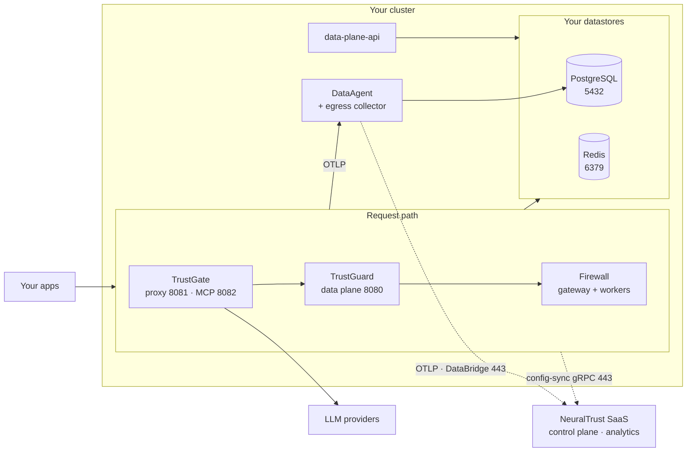
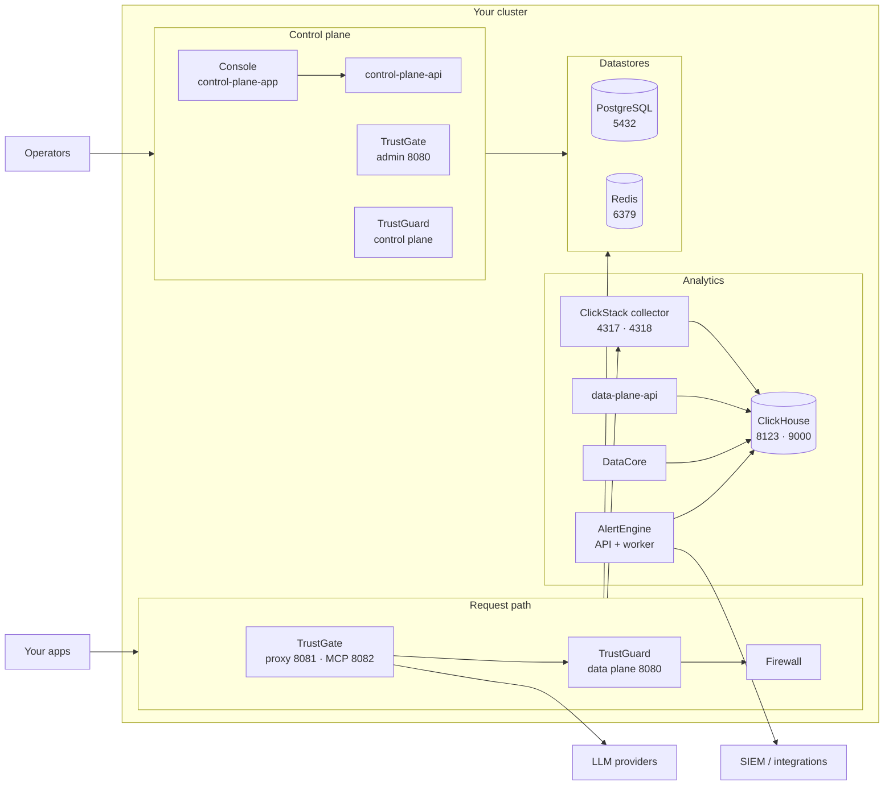

This is the page to hand to a platform or infrastructure team before an install.
It answers three questions: what runs, what it depends on, and what has to be
reachable. For the topology *decision* — SaaS, Hybrid, or External — start with
[Deployment models](/neuraltrust/deployment/deployment-models).

Everything below ships as a **single umbrella Helm chart**,
[`neuraltrust-platform`](https://github.com/NeuralTrust/neuraltrust-platform),
with one value selecting the topology:

```yaml
global:
  deploymentMode: hybrid # hybrid | external
```

## Hybrid

The request path runs in your cluster; configuration and analytics stay on
NeuralTrust SaaS. Every connection to SaaS is initiated outbound from your
cluster.



| Component | Deployed when | Purpose |
| --- | --- | --- |
| TrustGate proxy + MCP | `global.products.trustgate` | AI gateway request path |
| TrustGuard data plane | `global.products.trustguard` | Runtime safety evaluation |
| Firewall (gateway + workers) | with TrustGuard | Prompt and response classifiers |
| data-plane API | `global.products.dataPlane` | Red teaming and evaluation API |
| DataAgent | one per enabled product | Outbound telemetry egress and entitled retrieval |
| PostgreSQL | `global.postgresql.deploy` | Raw payloads and product data |
| Redis | `global.redis.deploy` | Semantic cache, rate limiting |

TrustGate admin, the console, and analytics are **not** deployed in Hybrid —
they run on SaaS. There is no in-cluster ClickHouse in Hybrid.

## External (self-hosted)

External adds the control planes, the console, and the analytics stack, and
removes the SaaS runtime dependency entirely.



The full per-mode component matrix, including which values gate each one, lives
in the chart's
[`docs/architecture.md`](https://github.com/NeuralTrust/neuraltrust-platform/blob/main/docs/architecture.md).

## Infrastructure dependencies

The chart can run every datastore in-cluster for evaluation. For production,
point it at managed instances instead. Nothing here is optional-but-hidden: if a
row says required, the platform does not start without it.

| Dependency | Required | Chart can deploy it | Version the chart ships | Port | Used for |
| --- | --- | --- | --- | --- | --- |
| **PostgreSQL** | Yes | Yes (`global.postgresql.deploy`) | 17 | 5432 | Product data, raw payloads, control-plane state |
| **Redis** | Yes | Yes (`global.redis.deploy`) | 7.2 | 6379 | Semantic cache, rate limiting, evaluation progress |
| **ClickHouse** | External mode only | Yes (`infrastructure.clickhouse.deploy`) | 26.7 | 8123 / 9000 | Self-hosted analytics and telemetry |
| **Ingress or Routes** | Yes | Renders the objects | — | 443 | Public entry points |
| **StorageClass** | Yes, when running in-cluster stores | No | — | — | PostgreSQL, Redis, ClickHouse volumes |
| **Container registry** | Yes | No | — | 443 | Image pull (or your mirror) |
| **LLM providers** | Yes, for the gateway path | No | — | 443 | Upstream model calls |
| cert-manager | No | No | — | — | TLS automation, if you use it |
| External Secrets Operator | No | No | — | — | Credential delivery, if you use it |
| Object storage (S3 / Azure Blob) | No | No | — | 443 | ClickHouse backups, External mode |
| SMTP or email provider | External mode only | No | — | 587 / 443 | Console invitations |

Redis is **not** optional and it is not only a cache: TrustGate uses it for rate
limiting and semantic caching on the request path. Redis OSS is sufficient —
there is no Enterprise-only feature in use. The chart's in-cluster Redis runs a
plain `redis-server`.

### Not required

Deployments sometimes budget for these because older material mentioned them, or
because comparable products need them. Platform v2 does **not**:

| Not required | Why |
| --- | --- |
| **Kafka** or any message broker | Removed in v2. Telemetry is OTLP; the legacy Kafka pipeline ended with chart v1. |
| A dedicated **vector database** | Semantic caching uses Redis. There is no Milvus, Qdrant, or pgvector requirement. |
| A **service mesh** | In-cluster hops are plain Services. |
| **GPU nodes** | CPU Firewall images are the default; GPU is opt-in for higher throughput — see [Firewall](/neuraltrust/deployment/firewall). |

<Note>
If you are working from documentation or a diagram that shows Kafka, it predates
chart **v2.0.0**. The legacy TrustGate/Kafka line ended at v1.14.16.
</Note>

## Datastore sizing floors

| Store | Minimum for production | Notes |
| --- | --- | --- |
| PostgreSQL | 2 vCPU, 4 GiB RAM, 20 GiB storage | Grows with retained raw payloads |
| Redis | 1 GiB memory | No persistence requirement |
| ClickHouse | 50 GiB volume, 4 GiB memory | External mode; scale with retention |

Cluster-level capacity — roughly 3–4 workers at 8 vCPU / 16–32 GiB for Hybrid,
4–5 for External — is in [Cluster sizing](/neuraltrust/deployment/sizing).

## Egress and ingress

Hybrid requires outbound HTTPS to NeuralTrust for config-sync, telemetry, and
DataBridge, plus one inbound source IP for console health checks of your
Dataplane URL. External requires none of it.

The authoritative hostname and IP list, which you should use rather than copying
values from this page, is
[Hybrid network allowlist](/neuraltrust/deployment/network).

## Where each interface is documented

| Question | Answer lives in |
| --- | --- |
| Every value the chart accepts | [`values.yaml`](https://github.com/NeuralTrust/neuraltrust-platform/blob/main/values.yaml) |
| Which Secret holds which key | [Secrets](/neuraltrust/deployment/secrets) · [`SECRETS.md`](https://github.com/NeuralTrust/neuraltrust-platform/blob/main/SECRETS.md) |
| Managed datastore wiring | [Configuration](/neuraltrust/deployment/configuration#managed-stores) |
| Images to mirror for a disconnected cluster | [Images](/neuraltrust/deployment/images) |
| Provider specifics | [GCP](/neuraltrust/deployment/gcp/overview) · [AWS](/neuraltrust/deployment/aws/overview) · [Azure](/neuraltrust/deployment/azure/overview) · [OpenShift](/neuraltrust/deployment/openshift/overview) · [Kubernetes](/neuraltrust/deployment/kubernetes/overview) |
