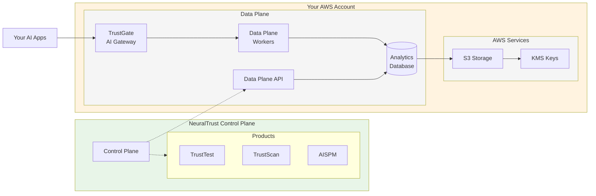

# Deploy NeuralTrust on Amazon Web Services

NeuralTrust provides **global multi-region deployment** across all AWS regions while ensuring your data never leaves your AWS account. We handle all infrastructure complexity while maintaining the highest security standards for enterprise AI monitoring, providing a fully managed service that combines the benefits of cloud-scale infrastructure with complete data sovereignty.

Our AWS deployment model ensures that your sensitive AI monitoring data remains within your AWS environment at all times, while benefiting from NeuralTrust's expertise in infrastructure management, security hardening, and operational excellence. This approach provides the optimal balance of control, security, and convenience for enterprise AI monitoring deployments.

## Architecture Overview



**Key Architecture Benefits:**
- **🔒 Data Sovereignty**: All your data stays in your AWS account
- **⚡ Automated Setup**: VPC, EKS, S3, KMS automatically created
- **🛡️ Zero Trust**: TrustGate validates all AI traffic before processing

## Global Deployment Capabilities

### Universal AWS Region Support

NeuralTrust supports deployment in **ALL commercial AWS regions worldwide** with no exceptions, providing global coverage that enables organizations to deploy AI monitoring infrastructure close to their users and data sources while meeting data residency requirements.

| Region Group | Regions | Description |
|--------------|---------|-------------|
| **Americas** | **US East**: us-east-1 (N. Virginia), us-east-2 (Ohio)<br/>**US West**: us-west-1 (N. California), us-west-2 (Oregon)<br/>**Canada**: ca-central-1 (Central), ca-west-1 (Calgary)<br/>**South America**: sa-east-1 (São Paulo) | Complete coverage across North and South America |
| **Europe** | **EU West**: eu-west-1 (Ireland), eu-west-2 (London), eu-west-3 (Paris)<br/>**EU Central**: eu-central-1 (Frankfurt), eu-central-2 (Zurich)<br/>**EU North**: eu-north-1 (Stockholm)<br/>**EU South**: eu-south-1 (Milan), eu-south-2 (Spain) | Full European coverage for data residency compliance |
| **Asia Pacific** | **AP Southeast**: ap-southeast-1 (Singapore), ap-southeast-2 (Sydney), ap-southeast-3 (Jakarta), ap-southeast-4 (Melbourne), ap-southeast-5 (Malaysia)<br/>**AP Northeast**: ap-northeast-1 (Tokyo), ap-northeast-2 (Seoul), ap-northeast-3 (Osaka)<br/>**AP South**: ap-south-1 (Mumbai), ap-south-2 (Hyderabad)<br/>**AP East**: ap-east-1 (Hong Kong) | Comprehensive Asia-Pacific regional support |
| **Middle East & Africa** | **Middle East**: me-south-1 (Bahrain), me-central-1 (UAE)<br/>**Africa**: af-south-1 (Cape Town) | Strategic coverage for emerging markets |

### Regional Capabilities and Features

**Global AWS Region Support:**
NeuralTrust supports deployment across all current AWS commercial regions with automatic availability for new regions as they launch. Government cloud deployments include enhanced compliance features for regulatory requirements.

**Data Residency and Compliance:**
- **Regional Data Processing**: Choose your preferred region for primary data processing while maintaining data locality within specified geographic boundaries
- **Multi-Region Support**: Optional encrypted cross-region replication for disaster recovery scenarios

**Unified Management:**
All regional deployments are managed through a single NeuralTrust console interface, providing centralized administration across multiple AWS regions while maintaining regional data sovereignty.

## VPC and Infrastructure Creation

NeuralTrust automatically creates all required AWS infrastructure during the deployment process, including VPC, subnets, security groups, and networking components.

### Automated Infrastructure Deployment

**What NeuralTrust Creates:**
- **VPC**: `/20` CIDR block (4,094 usable IPs) in your chosen region
- **Subnets**: Multi-AZ public and private subnets for high availability
- **Networking**: Internet Gateway, NAT Gateways, Route Tables, Security Groups
- **EKS Cluster**: Kubernetes cluster with auto-scaling node groups
- **Load Balancers**: Application Load Balancers for TrustGate endpoints
- **Storage**: S3 buckets for backups and data rotation
- **Security**: Customer-managed KMS keys for encryption

**Network Architecture Created:**
```
Auto-Created VPC (10.0.0.0/20)
├── Public Subnets (for Load Balancers & NAT Gateways)
│   ├── us-west-2a: 10.0.1.0/24 (254 IPs)
│   └── us-west-2b: 10.0.2.0/24 (254 IPs)
└── Private Subnets (for EKS and Data Plane Components)
    ├── us-west-2a: 10.0.4.0/22 (1,022 IPs)
    └── us-west-2b: 10.0.8.0/22 (1,022 IPs)
```

**Security Configuration:**
- **Outbound**: HTTPS (443) to internet, internal communication within security groups
- **Inbound**: Only TrustGate API endpoints, no direct external access to private components

### Infrastructure Benefits

- **Zero Manual Setup**: No VPC or networking configuration required
- **Best Practices**: Enterprise-grade security and networking patterns
- **High Availability**: Multi-AZ deployment for resilience
- **Scalability**: Auto-scaling capabilities for varying workloads

> **Note**: All infrastructure is created in your AWS account using your credentials, ensuring complete data sovereignty.

## Storage and Data Management

### Enterprise Storage Configuration

**S3 Data Management**
- **Daily Database Backups**: Automated daily backups of analytics database stored in S3
- **Data Rotation**: Raw data rotated from analytics database to S3 after 6 months
- **Encrypted Storage**: All backups and rotated data encrypted with customer-managed keys
- **Lifecycle Management**: Automated archival and retention policies for both backups and rotated data

**Advanced S3 Security**
- **Bucket Policies**: Restrictive policies preventing unauthorized access
- **Versioning**: Complete version history
- **Object Lock**: Immutable storage for compliance requirements

### Data Lifecycle Management

**Data Retention and Rotation**
- **Analytics Database**: Real-time data stored for 6 months for active querying and analysis
- **S3 Rotation**: After 6 months, data automatically rotated from analytics database to S3
- **Long-term Storage**: S3 provides cost-effective long-term retention with encryption
- **Compliance Retention**: Configurable retention periods to meet regulatory requirements

**Backup and Recovery**
- **Daily Database Backups**: Automated daily backups to S3 with encryption
- **Recovery Options**: Restore from any daily backup within retention period
- **S3 Backup Protection**: Versioning and object lock for all backup data
- **Automated Testing**: Monthly disaster recovery validation
- **RTO/RPO Guarantees**: 4-hour recovery time

## Data Plane Installation Guide

### Prerequisites

Before beginning the Data Plane installation, ensure you have the following:

**AWS Account Setup:**
- AWS account with administrative access
- AWS CLI configured with appropriate credentials

**NeuralTrust Account:**
- Active NeuralTrust enterprise account
- Access to NeuralTrust Admin Portal
- Control Plane access credentials

### Step 1: IAM User and Policy Configuration

**1.1 Create Dedicated IAM User**

```bash
# Create IAM user for NeuralTrust Data Plane
aws iam create-user --user-name NeuralTrustDataPlaneUser
```

**1.2 Create and Attach Policy**

```bash
# Create the permissions policy
cat > neuraltrust-dataplane-policy.json << EOF
{
  "Version": "2012-10-17",
  "Statement": [
    {
      "Sid": "VPCInfrastructure",
      "Effect": "Allow",
      "Action": [
        "ec2:CreateVpc",
        "ec2:CreateSubnet",
        "ec2:CreateSecurityGroup",
        "ec2:CreateRouteTable",
        "ec2:CreateRoute",
        "ec2:CreateInternetGateway",
        "ec2:CreateNatGateway",
        "ec2:AttachInternetGateway",
        "ec2:AssociateRouteTable",
        "ec2:AuthorizeSecurityGroupIngress",
        "ec2:AuthorizeSecurityGroupEgress",
        "ec2:RevokeSecurityGroupIngress",
        "ec2:RevokeSecurityGroupEgress",
        "ec2:AllocateAddress",
        "ec2:CreateTags",
        "ec2:Describe*",
        "elasticloadbalancing:CreateLoadBalancer",
        "elasticloadbalancing:CreateTargetGroup",
        "elasticloadbalancing:CreateListener",
        "elasticloadbalancing:ModifyLoadBalancerAttributes",
        "elasticloadbalancing:ModifyTargetGroupAttributes",
        "elasticloadbalancing:RegisterTargets",
        "elasticloadbalancing:AddTags",
        "elasticloadbalancing:Describe*"
      ],
      "Resource": "*",
      "Condition": {
        "StringLike": {
          "aws:RequestedRegion": "YOUR-CHOSEN-REGION"
        }
      }
    },
    {
      "Sid": "KubernetesCluster",
      "Effect": "Allow",
      "Action": [
        "eks:CreateCluster",
        "eks:CreateNodegroup",
        "eks:UpdateClusterConfig",
        "eks:UpdateNodegroupConfig",
        "eks:TagResource",
        "eks:Describe*",
        "eks:List*",
        "ec2:RunInstances",
        "ec2:TerminateInstances",
        "autoscaling:CreateAutoScalingGroup",
        "autoscaling:UpdateAutoScalingGroup",
        "autoscaling:CreateLaunchTemplate",
        "autoscaling:CreateOrUpdateTags",
        "autoscaling:Describe*"
      ],
      "Resource": "*",
      "Condition": {
        "StringLike": {
          "aws:RequestedRegion": "YOUR-CHOSEN-REGION"
        }
      }
    },
    {
      "Sid": "IAMForEKS",
      "Effect": "Allow",
      "Action": [
        "iam:CreateRole",
        "iam:AttachRolePolicy",
        "iam:CreateInstanceProfile",
        "iam:AddRoleToInstanceProfile",
        "iam:PassRole",
        "iam:GetRole",
        "iam:ListAttachedRolePolicies"
      ],
      "Resource": [
        "arn:aws:iam::*:role/neuraltrust-*",
        "arn:aws:iam::*:instance-profile/neuraltrust-*"
      ]
    },
    {
      "Sid": "S3BucketCreation",
      "Effect": "Allow",
      "Action": [
        "s3:CreateBucket",
        "s3:PutBucketEncryption",
        "s3:PutBucketVersioning",
        "s3:PutBucketPolicy",
        "s3:PutBucketTagging",
        "s3:GetBucket*",
        "s3:ListBucket*"
      ],
      "Resource": "arn:aws:s3:::neuraltrust-*"
    },
    {
      "Sid": "S3ObjectAccess",
      "Effect": "Allow",
      "Action": [
        "s3:GetObject",
        "s3:PutObject",
        "s3:DeleteObject",
        "s3:GetObjectVersion",
        "s3:PutObjectTagging"
      ],
      "Resource": "arn:aws:s3:::neuraltrust-*/*"
    },
    {
      "Sid": "KMSKeyCreation",
      "Effect": "Allow",
      "Action": [
        "kms:CreateKey",
        "kms:CreateAlias",
        "kms:PutKeyPolicy",
        "kms:TagResource",
        "kms:DescribeKey",
        "kms:GetKeyPolicy",
        "kms:ListKeys",
        "kms:ListAliases"
      ],
      "Resource": "*",
      "Condition": {
        "StringLike": {
          "kms:AliasName": "alias/neuraltrust-*"
        }
      }
    },
    {
      "Sid": "KMSKeyUsage",
      "Effect": "Allow",
      "Action": [
        "kms:Encrypt",
        "kms:Decrypt",
        "kms:ReEncrypt*",
        "kms:GenerateDataKey*",
        "kms:DescribeKey"
      ],
      "Resource": "*",
      "Condition": {
        "StringLike": {
          "kms:AliasName": "alias/neuraltrust-*"
        }
      }
    },
    {
      "Sid": "SecretsManager",
      "Effect": "Allow",
      "Action": [
        "secretsmanager:CreateSecret",
        "secretsmanager:UpdateSecret",
        "secretsmanager:GetSecretValue",
        "secretsmanager:TagResource"
      ],
      "Resource": "arn:aws:secretsmanager:*:*:secret:neuraltrust/*"
    },
    {
      "Sid": "MonitoringAndLogging",
      "Effect": "Allow",
      "Action": [
        "cloudwatch:PutMetricData",
        "cloudwatch:CreateLogGroup",
        "cloudwatch:CreateLogStream",
        "cloudwatch:PutLogEvents",
        "logs:CreateLogGroup",
        "logs:CreateLogStream",
        "logs:PutLogEvents",
        "logs:DescribeLog*"
      ],
      "Resource": [
        "arn:aws:cloudwatch:*:*:*",
        "arn:aws:logs:*:*:log-group:/neuraltrust/*"
      ]
    }
  ]
}
EOF

# Create and attach the policy
aws iam create-policy \
    --policy-name NeuralTrustDataPlanePolicy \
    --policy-document file://neuraltrust-dataplane-policy.json

aws iam attach-user-policy \
    --user-name NeuralTrustDataPlaneUser \
    --policy-arn arn:aws:iam::YOUR-ACCOUNT-ID:policy/NeuralTrustDataPlanePolicy
```

**1.3 Generate Access Key**

```bash
# Create access key for the user
aws iam create-access-key --user-name NeuralTrustDataPlaneUser
```

Save the **Access Key ID** and **Secret Access Key** securely. You'll provide these credentials in the NeuralTrust Admin Portal.

### Step 2: Customer-Managed Encryption Keys

**2.1 Create Data Plane KMS Key**

```bash
# Create KMS key for Data Plane encryption
cat > kms-key-policy.json << EOF
{
  "Version": "2012-10-17",
  "Statement": [
    {
      "Sid": "EnableRootAccess",
      "Effect": "Allow",
      "Principal": {
        "AWS": "arn:aws:iam::YOUR-ACCOUNT-ID:root"
      },
      "Action": "kms:*",
      "Resource": "*"
    },
    {
      "Sid": "AllowNeuralTrustDataPlane",
      "Effect": "Allow",
      "Principal": {
        "AWS": "arn:aws:iam::YOUR-ACCOUNT-ID:role/NeuralTrustDataPlaneRole"
      },
      "Action": [
        "kms:Encrypt",
        "kms:Decrypt",
        "kms:ReEncrypt*",
        "kms:GenerateDataKey*",
        "kms:DescribeKey"
      ],
      "Resource": "*"
    }
  ]
}
EOF

# Create the KMS key
aws kms create-key \
    --description "NeuralTrust Data Plane Encryption Key" \
    --policy file://kms-key-policy.json

# Create an alias for easier reference
aws kms create-alias \
    --alias-name alias/neuraltrust-dataplane \
    --target-key-id KEY-ID-FROM-PREVIOUS-COMMAND
```

### Step 3: Deploy Data Plane via Admin Portal

**3.1 Access NeuralTrust Admin Portal**

1. Log into your NeuralTrust account at [https://portal.neuraltrust.ai](https://portal.neuraltrust.ai)
2. Navigate to **Data Plane** → **Deployments**
3. Click **"New Data Plane Deployment"**

**3.2 Configure Deployment Settings**

In the Admin Portal, provide the following information:

**AWS Configuration:**
- **AWS Account ID**: Your 12-digit AWS account ID
- **Access Key ID**: From the IAM user created in Step 1
- **Secret Access Key**: From the IAM user created in Step 1
- **AWS Region**: Your chosen deployment region (e.g., `us-west-2`)

**Data Plane Settings:**
- **Environment Name**: `production` (or your preferred name)
- **Instance Type**: `m5.xlarge` (recommended for production)
- **Min/Max Nodes**: Configure auto-scaling parameters
- **Data Retention**: 90 days (configurable)

**3.3 Initiate Deployment**

1. Review all configuration settings
2. Click **"Deploy Data Plane"**
3. Monitor deployment progress in real-time through the portal
4. Deployment typically takes 15-20 minutes

### Step 4: Verify Deployment

**4.1 Check Deployment Status**

Monitor the deployment through the Admin Portal:
- **Infrastructure Status**: All components show "Healthy"
- **TrustGate Services**: Both Admin and Gateway services running
- **Data Processing**: Workers and queue operational
- **Database**: Connection established and healthy

**4.2 Test Connectivity**

The portal provides built-in connectivity tests:
1. **Control Plane Connection**: Verify secure connection to NeuralTrust
2. **Internal Communication**: Test Data Plane component connectivity
3. **External Access**: Validate TrustGate endpoint accessibility

### Verification Checklist

**✅ Pre-Deployment Verification**
- [ ] IAM roles and policies configured correctly
- [ ] KMS keys created and accessible
- [ ] VPC and networking configured properly
- [ ] Admin Portal access confirmed

**✅ Deployment Verification**
- [ ] All Data Plane components deployed successfully
- [ ] TrustGate services healthy and accessible
- [ ] Connection to Control Plane established
- [ ] Monitoring and logging active

**✅ Application Integration**
- [ ] AI applications configured to use TrustGate
- [ ] End-to-end data flow tested
- [ ] Security policies validated
- [ ] Performance monitoring enabled

### Troubleshooting

**Common Issues and Solutions:**

**Deployment Failures:**
- Check IAM role permissions in AWS console
- Verify VPC configuration meets requirements
- Ensure KMS key accessibility

**Connectivity Issues:**
- Validate security group rules
- Check NAT Gateway configuration
- Verify DNS resolution

**Permission Errors:**
- Review IAM policy attachments
- Confirm cross-account role trust relationship
- Check KMS key permissions

### Support

For deployment assistance:
- **Technical Support**: support@neuraltrust.ai

---

> **🔒 Security Guarantee**: Your data never leaves your AWS environment. NeuralTrust provides enterprise-grade AI monitoring with military-grade security, complete data sovereignty, and global deployment capabilities across all AWS regions. 