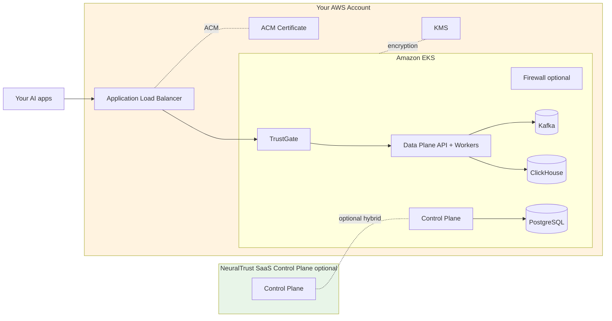

NeuralTrust Platform runs on Amazon EKS using AWS-native primitives — Application Load Balancer for ingress, EBS / EFS for persistent storage, ACM for certificates, and KMS / Secrets Manager (optional) for secret management. This page covers the AWS-specific prerequisites; the install workflow itself is the same as any other Kubernetes cluster.

For the cross-platform install workflow, start with [Install on Kubernetes](./kubernetes).

## Architecture



All workloads run inside your AWS account and VPC. Data never leaves your environment.

## Cluster prerequisites

| Resource | Recommended starting point |
|---|---|
| EKS version | 1.28 or newer |
| Worker node type | `m5.xlarge` or `m6i.xlarge` (4 vCPU / 16 GiB) |
| Min nodes | 3 (one per AZ) |
| VPC | At least 2 private subnets across 2 AZs |
| Storage | EBS CSI driver installed; `gp3` storage class |
| Ingress | [AWS Load Balancer Controller](https://kubernetes-sigs.github.io/aws-load-balancer-controller/latest/) v2.6+ |
| DNS | Route 53 (or any DNS provider) for the platform base domain |
| Certificates | ACM certificate covering `*.<your-domain>` |

For GPU Firewall workers, add a managed node group with `g5.xlarge` or `g6.xlarge` instances and the NVIDIA device plugin. See [Firewall deployment › GPU](./firewall#enable-the-firewall).

### Required cluster add-ons

```bash
# AWS Load Balancer Controller (for ingress)
helm repo add eks https://aws.github.io/eks-charts
helm install aws-load-balancer-controller eks/aws-load-balancer-controller \
  -n kube-system \
  --set clusterName=<EKS_CLUSTER_NAME> \
  --set serviceAccount.create=false \
  --set serviceAccount.name=aws-load-balancer-controller

# EBS CSI driver (for persistent volumes)
eksctl create addon \
  --name aws-ebs-csi-driver \
  --cluster <EKS_CLUSTER_NAME> \
  --service-account-role-arn arn:aws:iam::<ACCOUNT_ID>:role/AmazonEKS_EBS_CSI_DriverRole
```

The AWS LB Controller and EBS CSI driver each require IAM roles configured for IRSA (IAM Roles for Service Accounts). Refer to the AWS documentation for the full IAM policy contents.

## Install the Helm chart on EKS

<Steps>
  <Step title="Configure kubectl for the EKS cluster">
    ```bash
    aws eks update-kubeconfig --region <REGION> --name <EKS_CLUSTER_NAME>
    kubectl get nodes
    ```
  </Step>

  <Step title="Create the namespace and image pull secret">
    ```bash
    kubectl create namespace neuraltrust

    kubectl create secret docker-registry gcr-secret \
      --docker-server=europe-west1-docker.pkg.dev \
      --docker-username=_json_key \
      --docker-password="$(cat path/to/gcr-keys.json)" \
      --docker-email=admin@neuraltrust.ai \
      -n neuraltrust
    ```
  </Step>

  <Step title="Install with the AWS platform selector">
    ```bash
    helm upgrade --install neuraltrust-platform \
      oci://europe-west1-docker.pkg.dev/neuraltrust-app-prod/helm-charts/neuraltrust-platform \
      --version <VERSION> \
      --namespace neuraltrust \
      --set global.platform=aws \
      --set global.domain=platform.example.com \
      --set global.storageClass=gp3
    ```

    Replace `<VERSION>` with a chart version from the [release list](https://github.com/NeuralTrust/neuraltrust-platform/releases).
  </Step>

  <Step title="Point DNS at the ALB">
    The chart provisions an Application Load Balancer per ingress. Get the hostname:

    ```bash
    kubectl get ingress -n neuraltrust -o wide
    ```

    Create CNAME records in Route 53 (or your DNS provider) pointing each platform host (`app.<domain>`, `data-plane-api.<domain>`, etc.) at the ALB hostname.
  </Step>
</Steps>

## AWS-specific configuration

### ACM certificates with the AWS Load Balancer Controller

Reference an existing ACM certificate to terminate TLS at the ALB:

```yaml
trustgate:
  ingress:
    enabled: true
    annotations:
      alb.ingress.kubernetes.io/scheme: internet-facing
      alb.ingress.kubernetes.io/target-type: ip
      alb.ingress.kubernetes.io/listen-ports: '[{"HTTPS":443}]'
      alb.ingress.kubernetes.io/certificate-arn: "arn:aws:acm:<REGION>:<ACCOUNT_ID>:certificate/<CERT_ID>"

neuraltrust-control-plane:
  controlPlane:
    components:
      api:
        ingress:
          enabled: true
          annotations:
            alb.ingress.kubernetes.io/scheme: internet-facing
            alb.ingress.kubernetes.io/target-type: ip
            alb.ingress.kubernetes.io/certificate-arn: "arn:aws:acm:<REGION>:<ACCOUNT_ID>:certificate/<CERT_ID>"
```

Use a wildcard ACM certificate (`*.<your-domain>`) so all platform hostnames terminate against the same cert.

### Storage class

`gp3` is recommended for both performance and cost:

```yaml
global:
  storageClass: "gp3"
```

For higher-throughput ClickHouse workloads, you can override per-component to use `io2`:

```yaml
clickhouse:
  persistence:
    storageClass: "io2"
    size: 200Gi
```

### Internal-only ingress

For VPC-internal deployments (no internet exposure):

```yaml
trustgate:
  ingress:
    annotations:
      alb.ingress.kubernetes.io/scheme: internal
      alb.ingress.kubernetes.io/subnets: "subnet-aaa,subnet-bbb"   # private subnets
```

### GPU node pool for Firewall workers

Add a managed node group running `g5.xlarge` or larger, install the NVIDIA device plugin, then enable the Firewall with GPU workers:

```yaml
neuraltrust-firewall:
  firewall:
    enabled: true
    workerDefaults:
      image:
        repository: "europe-west1-docker.pkg.dev/.../firewall-gpu"
      resources:
        limits:
          nvidia.com/gpu: "1"
      nodeSelector:
        eks.amazonaws.com/nodegroup: "gpu-pool"
      tolerations:
        - key: "nvidia.com/gpu"
          operator: "Exists"
          effect: "NoSchedule"
      hostIPC: true
```

Full reference: [Firewall deployment](./firewall).

## Region availability

NeuralTrust runs in any AWS commercial region with EKS support. Choose the region closest to your application traffic and target LLM endpoints, or the one that meets your data-residency requirements. The chart and images are region-agnostic.

If you need GovCloud or specific compliance regions, contact [support@neuraltrust.ai](mailto:support@neuraltrust.ai).

## Backup and data lifecycle

For production, configure backups against the persistent stores rather than relying on EBS snapshots alone:

- **PostgreSQL**: AWS Backup, RDS-style logical dumps via `pg_dump`, or run PostgreSQL externally on RDS / Aurora and disable `neuraltrust-control-plane.infrastructure.postgresql.deploy`.
- **ClickHouse**: Built-in `BACKUP` to S3, or run ClickHouse externally (e.g. ClickHouse Cloud) and disable `infrastructure.clickhouse.deploy`.
- **Kafka**: For high-availability needs, use MSK and set `infrastructure.kafka.deploy: false` with `infrastructure.kafka.external.bootstrapServers`.

Pointing the chart at managed AWS data services is documented in [Configuration scenarios › External infrastructure only](./configuration#external-infrastructure-only).

## Verification

```bash
# All pods Running
kubectl get pods -n neuraltrust

# Ingresses and ALB hostnames
kubectl get ingress -n neuraltrust -o wide

# Health checks (replace hosts with your domain)
curl https://data-plane-api.platform.example.com/health
curl https://control-plane-api.platform.example.com/health
```

## Troubleshooting

### Ingress doesn't get an ALB

```bash
kubectl describe ingress -n neuraltrust <ingress-name>
kubectl logs -n kube-system deployment/aws-load-balancer-controller
```

Common causes: AWS LB Controller not installed, missing IAM permissions, or subnets without the right `kubernetes.io/role/elb` / `kubernetes.io/role/internal-elb` tags.

### PVCs stuck in `Pending`

```bash
kubectl describe pvc -n neuraltrust <pvc-name>
```

Verify the EBS CSI driver is installed and the storage class exists. If you set `global.storageClass: "gp3"`, ensure the `gp3` StorageClass object exists in the cluster.

### `ImagePullBackOff`

Recreate `gcr-secret` with the JSON key from NeuralTrust. See [Install on Kubernetes › Common issues](./kubernetes#common-issues).

## Related guides

- [Install on Kubernetes](./kubernetes) — full install workflow
- [Configuration scenarios](./configuration) — values files for common topologies
- [Secrets management](./secrets) — auto-generation and external secret stores
- [Firewall deployment](./firewall) — GPU workers on EKS
