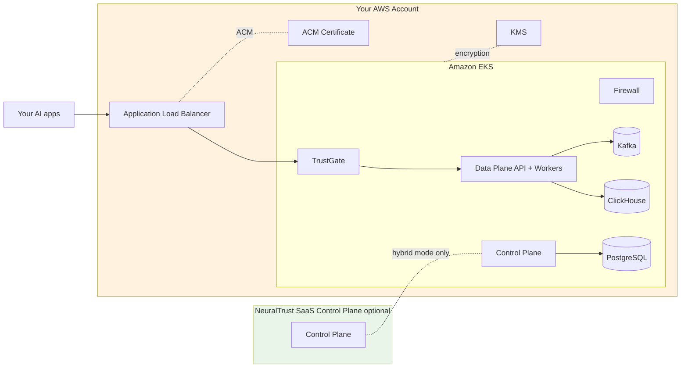

NeuralTrust Platform runs on Amazon EKS using AWS-native primitives — Application Load Balancer for ingress, ACM for certificates, EBS for persistent storage, IRSA for IAM, and Route 53 for DNS.

## Pick your path

<CardGroup cols={2}>
  <Card title="Hybrid (recommended)" icon="cloud" href="./hybrid">
    Data Plane + TrustGate + Firewall in your EKS cluster. Control Plane runs on NeuralTrust SaaS. Fastest to first dashboard.
  </Card>
  <Card title="Self-hosted" icon="shield" href="./self-hosted">
    Full stack including Control Plane API, UI, and Scheduler in your EKS cluster. For sovereignty and air-gapped requirements.
  </Card>
</CardGroup>

If you're unsure which model fits your environment, see [Deployment models](../deployment-models).

## Cluster prerequisites

| Resource | Recommended starting point |
|---|---|
| EKS version | 1.28 or newer |
| CPU pool node type | `m5.2xlarge` or `m6i.2xlarge` (8 vCPU / 32 GiB) |
| Min CPU nodes | **≥ 4 for hybrid (CPU Firewall)**, **≥ 5 for self-hosted (CPU Firewall)**. Subtract one when using GPU Firewall workers. ≥ 3 AZs for HA. |
| GPU pool *(optional)* | `g4dn.xlarge` (4 vCPU / 16 GiB / 1 × T4) — 5 nodes (one per default Firewall worker) |
| VPC | At least 3 private subnets across 3 AZs |
| Storage | EBS CSI driver installed; `gp3` storage class |
| Ingress | [AWS Load Balancer Controller](https://kubernetes-sigs.github.io/aws-load-balancer-controller/latest/) v2.6+ |
| DNS | Route 53 (or any DNS provider) for the platform base domain |
| Certificates | ACM certificate covering `*.<your-domain>` |

Smaller `m5.xlarge` (4 vCPU / 16 GiB) workers also work but require 7–8 nodes to fit the same workload. See [Deployment models › Sizing baseline](../deployment-models#sizing-baseline) for the math.

For GPU Firewall workers, add a managed node group with `g5.xlarge` / `g6.xlarge` and the NVIDIA device plugin.

### Required cluster add-ons

```bash
# AWS Load Balancer Controller (ingress)
helm repo add eks https://aws.github.io/eks-charts
helm install aws-load-balancer-controller eks/aws-load-balancer-controller \
  -n kube-system \
  --set clusterName=<EKS_CLUSTER_NAME> \
  --set serviceAccount.create=false \
  --set serviceAccount.name=aws-load-balancer-controller

# EBS CSI driver (persistent volumes)
eksctl create addon \
  --name aws-ebs-csi-driver \
  --cluster <EKS_CLUSTER_NAME> \
  --service-account-role-arn arn:aws:iam::<ACCOUNT_ID>:role/AmazonEKS_EBS_CSI_DriverRole
```

The AWS LB Controller and EBS CSI driver each require IAM roles configured for IRSA. See the AWS documentation for the full IAM policy contents.

## Architecture



All workloads run inside your AWS account and VPC. Data never leaves your environment.

## AWS-specific defaults

When `global.platform: "aws"`:

- **Ingress class**: `alb` (AWS Load Balancer Controller v2).
- **TLS**: prefers ACM via `alb.ingress.kubernetes.io/certificate-arn`. When no ARN is set, the chart provisions a self-signed `kubernetes.io/tls` secret.
- **Service annotations**: `alb.ingress.kubernetes.io/target-type: ip` for pod-direct routing; configurable scheme, target group, WAF, etc.
- **Storage class**: `gp3` recommended for cost/perf; `io2` for ClickHouse high-throughput.

## Common configuration

### ACM certificates

```yaml
trustgate:
  ingress:
    enabled: true
    annotations:
      alb.ingress.kubernetes.io/scheme: internet-facing
      alb.ingress.kubernetes.io/target-type: ip
      alb.ingress.kubernetes.io/listen-ports: '[{"HTTPS":443}]'
      alb.ingress.kubernetes.io/certificate-arn: "arn:aws:acm:<REGION>:<ACCOUNT_ID>:certificate/<CERT_ID>"
```

Use a wildcard ACM certificate (`*.<your-domain>`) so every platform hostname terminates against the same cert.

### Storage class

```yaml
global:
  storageClass: "gp3"                  # default — balanced cost / perf
```

ClickHouse override for `io2`:

```yaml
clickhouse:
  persistence:
    storageClass: "io2"
    size: 200Gi
```

### Internal-only ingress

For VPC-internal endpoints (no internet exposure):

```yaml
trustgate:
  ingress:
    annotations:
      alb.ingress.kubernetes.io/scheme: internal
      alb.ingress.kubernetes.io/subnets: "subnet-aaa,subnet-bbb"
```

### IRSA for managed services

For Cloud SQL alternatives (Aurora, RDS) and S3-backed ClickHouse backups, prefer IRSA over static credentials. Annotate the chart service accounts with the IAM role ARN:

```yaml
neuraltrust-data-plane:
  dataPlane:
    serviceAccount:
      create: true
      annotations:
        eks.amazonaws.com/role-arn: "arn:aws:iam::<ACCOUNT_ID>:role/neuraltrust-data-plane"
```

### GPU node group for Firewall workers

```bash
eksctl create nodegroup \
  --cluster <EKS_CLUSTER_NAME> \
  --name gpu-pool \
  --node-type g5.xlarge \
  --nodes 1 --nodes-min 1 --nodes-max 4 \
  --node-taints nvidia.com/gpu=true:NoSchedule
```

Install the NVIDIA device plugin, then enable the Firewall with GPU workers (see [Firewall deployment](../firewall)).

## Region availability

NeuralTrust runs in any AWS commercial region with EKS support. Choose the region closest to your traffic and target LLM endpoints, or one that meets your data-residency obligations.

For GovCloud or specific compliance regions, contact [support@neuraltrust.ai](mailto:support@neuraltrust.ai).

## Backup and data lifecycle

For production, configure backups against the persistent stores rather than relying on EBS snapshots alone:

- **PostgreSQL**: use Amazon RDS for PostgreSQL externally; disable `neuraltrust-control-plane.infrastructure.postgresql.deploy`.
- **ClickHouse**: enable `clickhouse.backup.enabled: true` with S3 storage (`backup.storage.s3.endpoint`), or run ClickHouse Cloud externally.
- **Kafka**: use MSK and set `infrastructure.kafka.deploy: false`.

External-infra reference: [Configuration scenarios](../configuration#external-infrastructure-only).

## Verification

```bash
kubectl get pods -n neuraltrust
kubectl get ingress -n neuraltrust -o wide

# Health checks (replace hosts with your domain)
curl https://data-plane-api.platform.example.com/health
```

## Common issues

| Symptom | Likely cause | Fix |
|---|---|---|
| Ingress doesn't get an ALB | AWS LB Controller not installed or wrong IAM | Check `kube-system` logs for the controller |
| Subnet `kubernetes.io/role/elb` tag missing | ALB Controller can't find target subnets | Tag at least 2 subnets with the correct role label |
| `PVC` stuck `Pending` | EBS CSI driver missing or wrong IAM | Verify driver installed and IRSA role attached |
| `ImagePullBackOff` | Missing or wrong `gcr-secret` | Recreate the secret with the JSON key from NeuralTrust |

## Next steps

- [Hybrid deployment on EKS](./hybrid) — Data Plane only, Control Plane on SaaS
- [Self-hosted deployment on EKS](./self-hosted) — full stack including CP
- [Deployment models](../deployment-models) — hybrid vs self-hosted in depth
- [Feature flags reference](../feature-flags) — local vs external Postgres/Redis/Kafka/CH, image registry, storage, secrets
- [Image catalog](../images) — what runs where
- [Firewall deployment](../firewall) — GPU workers on EKS
