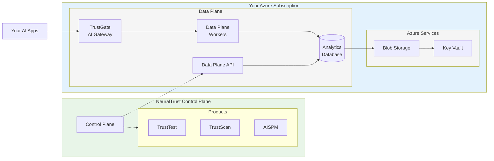

# Deploy NeuralTrust on Microsoft Azure

NeuralTrust provides **global deployment** across all Azure regions while ensuring your data never leaves your Azure subscription. We handle all infrastructure complexity while maintaining the highest security standards for enterprise AI monitoring, providing a fully managed service that combines the benefits of cloud-scale infrastructure with complete data sovereignty.

Our Azure deployment model ensures that your sensitive AI monitoring data remains within your Azure environment at all times, while benefiting from NeuralTrust's expertise in infrastructure management, security hardening, and operational excellence. This approach provides the optimal balance of control, security, and convenience for enterprise AI monitoring deployments.

## Architecture Overview



**Key Architecture Benefits:**
- **🔒 Data Sovereignty**: All your data stays in your Azure subscription
- **⚡ Automated Setup**: VNet, AKS, storage automatically created
- **🛡️ Zero Trust**: TrustGate validates all AI traffic before processing

## Global Deployment Capabilities

### Universal Azure Region Support

NeuralTrust supports deployment in **ALL commercial Azure regions worldwide** with no exceptions, providing global coverage that enables organizations to deploy AI monitoring infrastructure close to their users and data sources while meeting data residency requirements.

| Region Group | Regions | Description |
|--------------|---------|-------------|
| **Americas** | **US**: East US, East US 2, West US, West US 2, West US 3, Central US, North Central US, South Central US<br/>**Canada**: Canada Central, Canada East<br/>**Brazil**: Brazil South, Brazil Southeast | Complete coverage across North and South America |
| **Europe** | **EU West**: West Europe, North Europe, UK South, UK West<br/>**EU Central**: Germany West Central, Switzerland North<br/>**EU Nordic**: Norway East, Sweden Central<br/>**EU South**: France Central, Italy North | Full European coverage for GDPR compliance |
| **Asia Pacific** | **AP Southeast**: Southeast Asia, East Asia, Australia East, Australia Southeast<br/>**AP Northeast**: Japan East, Japan West, Korea Central<br/>**AP South**: Central India, South India, Jio India West | Comprehensive Asia-Pacific regional support |
| **Middle East & Africa** | **Middle East**: UAE North, Qatar Central<br/>**Africa**: South Africa North | Strategic coverage for emerging markets |

### Regional Capabilities and Features

**Global Azure Region Support:**
NeuralTrust supports deployment across all current Azure commercial regions with automatic availability for new regions as they launch. Government cloud deployments include enhanced compliance features for regulatory requirements.

**Data Residency and Compliance:**
- **Regional Data Processing**: Choose your preferred region for primary data processing while maintaining data locality within specified geographic boundaries
- **Cross-Region Replication**: Optional encrypted cross-region replication for disaster recovery scenarios

**Unified Management:**
All regional deployments are managed through a single NeuralTrust console interface, providing centralized administration across multiple Azure regions while maintaining regional data sovereignty.

## Virtual Network and Infrastructure Creation

NeuralTrust automatically creates all required Azure infrastructure during the deployment process, including Virtual Network, subnets, security groups, and networking components.

### Automated Infrastructure Deployment

**What NeuralTrust Creates:**
- **Virtual Network**: `/20` CIDR block (4,094 usable IPs) in your chosen region
- **Subnets**: Multi-zone public and private subnets for high availability
- **Networking**: Application Gateway, NAT Gateway, Route Tables, Network Security Groups
- **AKS Cluster**: Azure Kubernetes Service cluster with auto-scaling node pools
- **Load Balancers**: Application Gateway for TrustGate endpoints
- **Storage**: Blob Storage containers for backups and data rotation
- **Security**: Customer-managed Key Vault keys for encryption

**Network Architecture Created:**
```
Auto-Created Virtual Network (10.0.0.0/20)
├── Public Subnets (for Application Gateway & NAT Gateway)
│   ├── East US-1: 10.0.1.0/24 (254 IPs)
│   └── East US-2: 10.0.2.0/24 (254 IPs)
└── Private Subnets (for AKS and Data Plane Components)
    ├── East US-1: 10.0.4.0/22 (1,022 IPs)
    └── East US-2: 10.0.8.0/22 (1,022 IPs)
```

**Security Configuration:**
- **Outbound**: HTTPS (443) to internet, internal communication within security groups
- **Inbound**: Only TrustGate API endpoints, no direct external access to private components

### Infrastructure Benefits

- **Zero Manual Setup**: No Virtual Network or networking configuration required
- **Best Practices**: Enterprise-grade security and networking patterns
- **High Availability**: Multi-zone deployment for resilience
- **Scalability**: Auto-scaling capabilities for varying workloads

> **Note**: All infrastructure is created in your Azure subscription using your credentials, ensuring complete data sovereignty.

## Storage and Data Management

### Enterprise Storage Configuration

**Blob Storage Data Management**
- **Daily Database Backups**: Automated daily backups of analytics database stored in Blob Storage
- **Data Rotation**: Raw data rotated from analytics database to Blob Storage after 6 months
- **Encrypted Storage**: All backups and rotated data encrypted with customer-managed keys
- **Lifecycle Management**: Automated archival and retention policies for both backups and rotated data

**Advanced Storage Security**
- **Storage Policies**: Restrictive policies preventing unauthorized access
- **Versioning**: Complete version history
- **Immutable Storage**: Immutable storage for compliance requirements

### Data Lifecycle Management

**Data Retention and Rotation**
- **Analytics Database**: Real-time data stored for 6 months for active querying and analysis
- **Blob Storage Rotation**: After 6 months, data automatically rotated from analytics database to Blob Storage
- **Long-term Storage**: Blob Storage provides cost-effective long-term retention with encryption
- **Compliance Retention**: Configurable retention periods to meet regulatory requirements

**Backup and Recovery**
- **Daily Database Backups**: Automated daily backups to Blob Storage with encryption
- **Recovery Options**: Restore from any daily backup within retention period
- **Storage Backup Protection**: Versioning and immutable storage for all backup data
- **Automated Testing**: Monthly disaster recovery validation
- **RTO/RPO Guarantees**: 4-hour recovery time

## Data Plane Installation Guide

### Prerequisites

Before beginning the Data Plane installation, ensure you have the following:

**Azure Subscription Setup:**
- Azure subscription with administrative access
- Azure CLI configured with appropriate credentials

**NeuralTrust Account:**
- Active NeuralTrust enterprise account
- Access to NeuralTrust Admin Portal
- Control Plane access credentials

### Step 1: Service Principal Configuration

**1.1 Create Service Principal**

```bash
# Create service principal for NeuralTrust Data Plane
az ad sp create-for-rbac \
    --name "NeuralTrustDataPlaneUser" \
    --role "Contributor" \
    --scopes "/subscriptions/YOUR-SUBSCRIPTION-ID"
```

**1.2 Create Custom Role with Restricted Permissions**

```bash
# Create custom role definition
cat > neuraltrust-dataplane-role.json << EOF
{
  "Name": "NeuralTrust Data Plane Role",
  "Description": "Custom role for NeuralTrust Data Plane deployment with AKS and related resources",
  "Actions": [
    "Microsoft.Resources/subscriptions/resourceGroups/read",
    "Microsoft.Resources/subscriptions/resourceGroups/write",
    "Microsoft.Resources/subscriptions/resourceGroups/delete",
    "Microsoft.ContainerService/managedClusters/read",
    "Microsoft.ContainerService/managedClusters/write",
    "Microsoft.ContainerService/managedClusters/delete",
    "Microsoft.ContainerService/managedClusters/listClusterUserCredential/action",
    "Microsoft.ContainerService/managedClusters/agentPools/read",
    "Microsoft.ContainerService/managedClusters/agentPools/write",
    "Microsoft.ContainerService/managedClusters/agentPools/delete",
    "Microsoft.Network/virtualNetworks/read",
    "Microsoft.Network/virtualNetworks/write",
    "Microsoft.Network/virtualNetworks/delete",
    "Microsoft.Network/virtualNetworks/subnets/read",
    "Microsoft.Network/virtualNetworks/subnets/write",
    "Microsoft.Network/virtualNetworks/subnets/delete",
    "Microsoft.Network/virtualNetworks/subnets/join/action",
    "Microsoft.Network/networkSecurityGroups/read",
    "Microsoft.Network/networkSecurityGroups/write",
    "Microsoft.Network/networkSecurityGroups/delete",
    "Microsoft.Network/routeTables/read",
    "Microsoft.Network/routeTables/write",
    "Microsoft.Network/routeTables/delete",
    "Microsoft.Network/applicationGateways/read",
    "Microsoft.Network/applicationGateways/write",
    "Microsoft.Network/applicationGateways/delete",
    "Microsoft.Network/natGateways/read",
    "Microsoft.Network/natGateways/write",
    "Microsoft.Network/natGateways/delete",
    "Microsoft.Compute/availabilitySets/read",
    "Microsoft.Compute/availabilitySets/write",
    "Microsoft.Compute/availabilitySets/delete",
    "Microsoft.Compute/virtualMachines/read",
    "Microsoft.Compute/virtualMachines/write",
    "Microsoft.Compute/virtualMachines/delete",
    "Microsoft.Storage/storageAccounts/read",
    "Microsoft.Storage/storageAccounts/write",
    "Microsoft.Storage/storageAccounts/delete",
    "Microsoft.KeyVault/vaults/read",
    "Microsoft.KeyVault/vaults/write",
    "Microsoft.KeyVault/vaults/delete",
    "Microsoft.ManagedIdentity/userAssignedIdentities/read",
    "Microsoft.ManagedIdentity/userAssignedIdentities/write",
    "Microsoft.ManagedIdentity/userAssignedIdentities/delete",
    "Microsoft.Authorization/roleAssignments/read",
    "Microsoft.Authorization/roleAssignments/write",
    "Microsoft.Authorization/roleAssignments/delete",
    "Microsoft.Insights/components/read",
    "Microsoft.Insights/components/write",
    "Microsoft.OperationalInsights/workspaces/read",
    "Microsoft.OperationalInsights/workspaces/write"
  ],
  "NotActions": [],
  "AssignableScopes": [
    "/subscriptions/YOUR-SUBSCRIPTION-ID"
  ]
}
EOF

# Create the custom role
az role definition create --role-definition neuraltrust-dataplane-role.json

# Assign custom role to service principal
az role assignment create \
    --assignee "YOUR-SERVICE-PRINCIPAL-ID" \
    --role "NeuralTrust Data Plane Role" \
    --scope "/subscriptions/YOUR-SUBSCRIPTION-ID"
```

Save the **Application ID**, **Tenant ID**, and **Client Secret** securely. You'll provide these credentials in the NeuralTrust Admin Portal.

### Step 2: Customer-Managed Key Vault Keys

**2.1 Create Key Vault and Encryption Key**

```bash
# Create resource group for keys
az group create --name neuraltrust-keys-rg --location "East US"

# Create Key Vault
az keyvault create \
    --name neuraltrust-dataplane-kv \
    --resource-group neuraltrust-keys-rg \
    --location "East US" \
    --enable-disk-encryption

# Create encryption key
az keyvault key create \
    --vault-name neuraltrust-dataplane-kv \
    --name neuraltrust-dataplane-key \
    --protection software
```

### Step 3: Deploy Data Plane via Admin Portal

**3.1 Access NeuralTrust Admin Portal**

1. Log into your NeuralTrust account at [https://portal.neuraltrust.ai](https://portal.neuraltrust.ai)
2. Navigate to **Data Plane** → **Deployments**
3. Click **"New Data Plane Deployment"**

**3.2 Configure Deployment Settings**

In the Admin Portal, provide the following information:

**Azure Configuration:**
- **Subscription ID**: Your Azure subscription ID
- **Application ID**: From the service principal created in Step 1
- **Client Secret**: From the service principal created in Step 1
- **Tenant ID**: Your Azure Active Directory tenant ID
- **Azure Region**: Your chosen deployment region (e.g., `East US`)

**Data Plane Settings:**
- **Environment Name**: `production` (or your preferred name)
- **Instance Type**: `Standard_D4s_v3` (recommended for production)
- **Min/Max Nodes**: Configure auto-scaling parameters
- **Data Retention**: 90 days (configurable)

**3.3 Initiate Deployment**

1. Review all configuration settings
2. Click **"Deploy Data Plane"**
3. Monitor deployment progress in real-time through the portal
4. Deployment typically takes 15-20 minutes

### Step 4: Verify Deployment

**4.1 Check Deployment Status**

Monitor the deployment through the Admin Portal:
- **Infrastructure Status**: All components show "Healthy"
- **TrustGate Services**: Both Admin and Gateway services running
- **Data Processing**: Workers and queue operational
- **Database**: Connection established and healthy

**4.2 Test Connectivity**

The portal provides built-in connectivity tests:
1. **Control Plane Connection**: Verify secure connection to NeuralTrust
2. **Internal Communication**: Test Data Plane component connectivity
3. **External Access**: Validate TrustGate endpoint accessibility

### Verification Checklist

**✅ Pre-Deployment Verification**
- [ ] Service principal created with correct permissions
- [ ] Key Vault and encryption keys configured
- [ ] Admin Portal access confirmed

**✅ Deployment Verification**
- [ ] All Data Plane components deployed successfully
- [ ] TrustGate services healthy and accessible
- [ ] Connection to Control Plane established
- [ ] Monitoring and logging active

**✅ Application Integration**
- [ ] AI applications configured to use TrustGate
- [ ] End-to-end data flow tested
- [ ] Security policies validated
- [ ] Performance monitoring enabled

### Troubleshooting

**Common Issues and Solutions:**

**Deployment Failures:**
- Check service principal permissions in Azure portal
- Verify subscription quota limits
- Ensure Key Vault accessibility

**Connectivity Issues:**
- Validate Network Security Group rules
- Check Application Gateway configuration
- Verify DNS resolution

**Permission Errors:**
- Review custom role assignments
- Confirm service principal trust relationship
- Check Key Vault access policies

### Support

For deployment assistance:
- **Technical Support**: support@neuraltrust.ai
- **Documentation**: https://docs.neuraltrust.ai/dataplane/azure

---

> **🔒 Security Guarantee**: Your data never leaves your Azure environment. NeuralTrust provides enterprise-grade AI monitoring with military-grade security, complete data sovereignty, and global deployment capabilities across all Azure regions. 