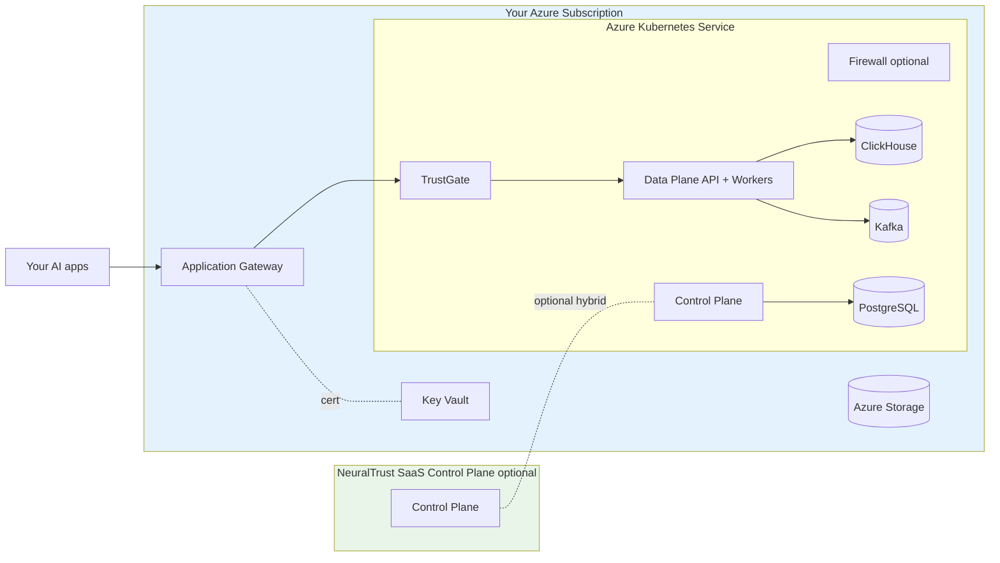

NeuralTrust Platform runs on Azure Kubernetes Service using Azure-native primitives — Application Gateway Ingress Controller (AGIC) or NGINX for ingress, Azure Disk / Azure Files for persistent storage, Key Vault for certificates, and Azure Monitor for observability. This page covers Azure-specific prerequisites; the install workflow itself is the same as any other Kubernetes cluster.

For the cross-platform install workflow, start with [Install on Kubernetes](./kubernetes).

## Architecture



All workloads run inside your Azure subscription and VNet. Data never leaves your environment.

## Cluster prerequisites

| Resource | Recommended starting point |
|---|---|
| AKS version | 1.28 or newer |
| Worker node SKU | `Standard_D4s_v5` or `Standard_D4ds_v5` (4 vCPU / 16 GiB) |
| Min nodes | 3 across at least 2 availability zones |
| VNet | Dedicated VNet with at least one subnet for AKS, one for Application Gateway (if using AGIC) |
| Storage | Azure Disk CSI driver (default in AKS); `managed-csi-premium` for production |
| Ingress | AGIC, NGINX, or any Kubernetes-conformant ingress controller |
| DNS | Azure DNS (or any DNS provider) for the platform base domain |
| Certificates | Key Vault certificate referenced by AGIC, or pre-existing TLS secrets |

For GPU Firewall workers, add an `Standard_NC*` or `Standard_ND*` node pool with the NVIDIA device plugin. See [Firewall deployment › GPU](./firewall#enable-the-firewall).

### Required cluster add-ons

```bash
# Application Gateway Ingress Controller (option A — managed AGIC)
az aks enable-addons -n <AKS_NAME> -g <RG> -a ingress-appgw \
  --appgw-name <AGW_NAME> --appgw-subnet-cidr "10.0.1.0/24"

# Or NGINX Ingress (option B)
helm repo add ingress-nginx https://kubernetes.github.io/ingress-nginx
helm install ingress-nginx ingress-nginx/ingress-nginx \
  -n ingress-nginx --create-namespace
```

The Azure Disk CSI driver is enabled by default on AKS.

## Install the Helm chart on AKS

<Steps>
  <Step title="Configure kubectl for the AKS cluster">
    ```bash
    az aks get-credentials --resource-group <RG> --name <AKS_NAME>
    kubectl get nodes
    ```
  </Step>

  <Step title="Create the namespace and image pull secret">
    ```bash
    kubectl create namespace neuraltrust

    kubectl create secret docker-registry gcr-secret \
      --docker-server=europe-west1-docker.pkg.dev \
      --docker-username=_json_key \
      --docker-password="$(cat path/to/gcr-keys.json)" \
      --docker-email=admin@neuraltrust.ai \
      -n neuraltrust
    ```
  </Step>

  <Step title="Install with the Azure platform selector">
    ```bash
    helm upgrade --install neuraltrust-platform \
      oci://europe-west1-docker.pkg.dev/neuraltrust-app-prod/helm-charts/neuraltrust-platform \
      --version <VERSION> \
      --namespace neuraltrust \
      --set global.platform=azure \
      --set global.domain=platform.example.com \
      --set global.storageClass=managed-csi-premium
    ```
  </Step>

  <Step title="Point DNS at the ingress">
    ```bash
    kubectl get ingress -n neuraltrust -o wide
    ```

    For AGIC, look up the Application Gateway's public IP / FQDN. For NGINX, get the LoadBalancer Service's external IP. Create A or CNAME records in Azure DNS for each platform host.
  </Step>
</Steps>

## Azure-specific configuration

### AGIC annotations

```yaml
trustgate:
  ingress:
    enabled: true
    className: "azure-application-gateway"
    annotations:
      kubernetes.io/ingress.class: azure/application-gateway
      appgw.ingress.kubernetes.io/ssl-redirect: "true"
      appgw.ingress.kubernetes.io/appgw-ssl-certificate: "<KEY_VAULT_CERT_NAME>"

neuraltrust-control-plane:
  controlPlane:
    components:
      api:
        ingress:
          enabled: true
          className: "azure-application-gateway"
          annotations:
            kubernetes.io/ingress.class: azure/application-gateway
            appgw.ingress.kubernetes.io/ssl-redirect: "true"
            appgw.ingress.kubernetes.io/appgw-ssl-certificate: "<KEY_VAULT_CERT_NAME>"
```

The Key Vault certificate must be uploaded to Application Gateway via AGIC's [`appgw-ssl-certificate`](https://azure.github.io/application-gateway-kubernetes-ingress/annotations/) workflow.

### NGINX ingress

```yaml
trustgate:
  ingress:
    enabled: true
    className: "nginx"
    annotations:
      cert-manager.io/cluster-issuer: "letsencrypt-prod"
      nginx.ingress.kubernetes.io/ssl-redirect: "true"
```

Pair with [cert-manager](https://cert-manager.io/) for automatic Let's Encrypt issuance.

### Storage class

```yaml
global:
  storageClass: "managed-csi-premium"   # SSD-backed, recommended for production
  # storageClass: "managed-csi"          # cheaper, standard SSD
  # storageClass: "azurefile-csi"        # only for ReadWriteMany scenarios
```

Per-component override for ClickHouse on `Premium_LRS`:

```yaml
clickhouse:
  persistence:
    storageClass: "managed-csi-premium"
    size: 200Gi
```

### Internal-only ingress

For private AKS clusters and VNet-internal endpoints, use AGIC with a private Application Gateway, or NGINX with an internal load balancer:

```yaml
trustgate:
  ingress:
    annotations:
      service.beta.kubernetes.io/azure-load-balancer-internal: "true"
```

### GPU node pool for Firewall workers

```bash
az aks nodepool add -g <RG> --cluster-name <AKS_NAME> \
  --name gpupool --node-vm-size Standard_NC8as_T4_v3 --node-count 1 \
  --node-taints "nvidia.com/gpu=true:NoSchedule"
```

```yaml
neuraltrust-firewall:
  firewall:
    enabled: true
    workerDefaults:
      image:
        repository: "europe-west1-docker.pkg.dev/.../firewall-gpu"
      resources:
        limits:
          nvidia.com/gpu: "1"
      nodeSelector:
        agentpool: "gpupool"
      tolerations:
        - key: "nvidia.com/gpu"
          operator: "Exists"
          effect: "NoSchedule"
      hostIPC: true
```

Full reference: [Firewall deployment](./firewall).

## Region availability

NeuralTrust runs in any Azure commercial region with AKS support. Choose the region closest to your application traffic and target LLM endpoints, or one that meets your data-residency obligations (e.g. GDPR for European customers). The chart and images are region-agnostic.

For Azure Government clouds or specific sovereign regions, contact [support@neuraltrust.ai](mailto:support@neuraltrust.ai).

## Backup and data lifecycle

For production, configure backups against the persistent stores rather than relying on managed disk snapshots alone:

- **PostgreSQL**: Use Azure Database for PostgreSQL Flexible Server externally and disable `neuraltrust-control-plane.infrastructure.postgresql.deploy`. Built-in PITR backups apply.
- **ClickHouse**: Use ClickHouse `BACKUP` to Azure Blob Storage, or run ClickHouse Cloud externally and set `infrastructure.clickhouse.deploy: false`.
- **Kafka**: For higher availability, use Confluent Cloud or Azure Event Hubs (Kafka surface) and set `infrastructure.kafka.deploy: false`.

Pointing the chart at managed Azure data services is documented in [Configuration scenarios › External infrastructure only](./configuration#external-infrastructure-only).

## Verification

```bash
kubectl get pods -n neuraltrust
kubectl get ingress -n neuraltrust -o wide

curl https://data-plane-api.platform.example.com/health
curl https://control-plane-api.platform.example.com/health
```

## Troubleshooting

### Ingress doesn't acquire an IP / FQDN

```bash
kubectl describe ingress -n neuraltrust <ingress-name>
# AGIC logs (managed add-on)
az aks show -g <RG> -n <AKS_NAME> --query "addonProfiles.ingressApplicationGateway"
```

Common causes: AGIC not enabled, Application Gateway subnet wrongly sized, or NSG blocking the AKS-AGW path.

### PVCs stuck in `Pending`

```bash
kubectl describe pvc -n neuraltrust <pvc-name>
```

Verify the configured storage class exists (`kubectl get storageclass`) and your subscription has quota for the SKU it references.

### `ImagePullBackOff`

Recreate `gcr-secret` with the JSON key from NeuralTrust. See [Install on Kubernetes › Common issues](./kubernetes#common-issues).

## Related guides

- [Install on Kubernetes](./kubernetes) — full install workflow
- [Configuration scenarios](./configuration) — values files for common topologies
- [Secrets management](./secrets) — auto-generation and external secret stores
- [Firewall deployment](./firewall) — GPU workers on AKS
