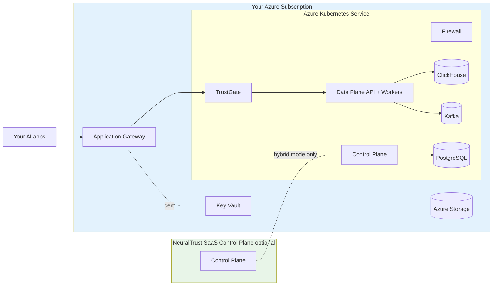

NeuralTrust Platform runs on Azure Kubernetes Service using Azure-native primitives — Application Gateway Ingress Controller (AGIC) or NGINX for ingress, Azure Disk for persistent storage, Key Vault for certificates, and Azure DNS for hostnames.

## Pick your path

<CardGroup cols={2}>
  <Card title="Hybrid (recommended)" icon="cloud" href="./hybrid">
    Data Plane + TrustGate + Firewall in your AKS cluster. Control Plane runs on NeuralTrust SaaS. Fastest to first dashboard.
  </Card>
  <Card title="Self-hosted" icon="shield" href="./self-hosted">
    Full stack including Control Plane API, UI, and Scheduler in your AKS cluster. For sovereignty and air-gapped requirements.
  </Card>
</CardGroup>

If you're unsure which model fits your environment, see [Deployment models](../deployment-models).

## Cluster prerequisites

| Resource | Recommended starting point |
|---|---|
| AKS version | 1.28 or newer |
| CPU pool node SKU | `Standard_D8s_v5` or `Standard_D8ds_v5` (8 vCPU / 32 GiB) |
| Min CPU nodes | **≥ 4 for hybrid (CPU Firewall)**, **≥ 5 for self-hosted (CPU Firewall)**. Subtract one when using GPU Firewall workers. Across 3 AZs for HA. |
| GPU pool *(optional)* | `Standard_NC4as_T4_v3` (4 vCPU / 28 GiB / 1 × T4) — 5 nodes (one per default Firewall worker) |
| VNet | Dedicated VNet with subnets for AKS and Application Gateway (if using AGIC) |
| Storage | Azure Disk CSI driver (default); `managed-csi-premium` for production |
| Ingress | AGIC, NGINX, or any conformant ingress controller |
| DNS | Azure DNS or any DNS provider |
| Certificates | Key Vault certificate referenced by AGIC, or pre-existing TLS secrets |

Smaller `Standard_D4s_v5` (4 vCPU / 16 GiB) workers also work but require 7–8 nodes to fit the same workload. See [Deployment models › Sizing baseline](../deployment-models#sizing-baseline) for the math.

For GPU Firewall workers, add a `Standard_NC*` or `Standard_ND*` node pool with the NVIDIA device plugin.

### Required cluster setup

```bash
# Create AKS cluster
az aks create -g <RG> -n neuraltrust \
  --node-count 4 \
  --node-vm-size Standard_D8s_v5 \
  --zones 1 2 3 \
  --enable-managed-identity \
  --enable-addons monitoring

# Configure kubectl
az aks get-credentials --resource-group <RG> --name neuraltrust
```

The Azure Disk CSI driver is enabled by default on AKS.

### Ingress add-on

<Tabs>
  <Tab title="AGIC (managed)">
    ```bash
    az aks enable-addons -n neuraltrust -g <RG> \
      -a ingress-appgw \
      --appgw-name <AGW_NAME> \
      --appgw-subnet-cidr "10.0.1.0/24"
    ```

    AGIC integrates AKS with Application Gateway. Best when you want a managed, WAF-capable L7 LB and don't mind the additional Azure resource.
  </Tab>
  <Tab title="NGINX">
    ```bash
    helm repo add ingress-nginx https://kubernetes.github.io/ingress-nginx
    helm install ingress-nginx ingress-nginx/ingress-nginx \
      -n ingress-nginx --create-namespace
    ```

    Pair with cert-manager for automatic Let's Encrypt issuance.
  </Tab>
</Tabs>

## Architecture



All workloads run inside your Azure subscription and VNet. Data never leaves your environment.

## Azure-specific defaults

When `global.platform: "azure"`:

- **Ingress class**: `azure-application-gateway` (with AGIC annotations).
- **TLS**: AGIC integrates Key Vault certificates via `appgw.ingress.kubernetes.io/appgw-ssl-certificate`; NGINX uses standard `kubernetes.io/tls` secrets (typically cert-manager-issued).
- **Storage class**: `managed-csi-premium` recommended for production; `managed-csi` for cost-sensitive non-prod.

## Common configuration

### AGIC annotations

```yaml
trustgate:
  ingress:
    enabled: true
    className: "azure-application-gateway"
    annotations:
      kubernetes.io/ingress.class: azure/application-gateway
      appgw.ingress.kubernetes.io/ssl-redirect: "true"
      appgw.ingress.kubernetes.io/appgw-ssl-certificate: "<KEY_VAULT_CERT_NAME>"
```

The Key Vault certificate must be referenced by AGIC via the `appgw-ssl-certificate` workflow.

### NGINX + cert-manager

```yaml
trustgate:
  ingress:
    enabled: true
    className: "nginx"
    annotations:
      cert-manager.io/cluster-issuer: "letsencrypt-prod"
      nginx.ingress.kubernetes.io/ssl-redirect: "true"
```

### Storage class

```yaml
global:
  storageClass: "managed-csi-premium"   # SSD-backed (production)
  # storageClass: "managed-csi"          # standard SSD (lower cost)
  # storageClass: "azurefile-csi"        # only for RWX scenarios
```

ClickHouse override on Premium SSD:

```yaml
clickhouse:
  persistence:
    storageClass: "managed-csi-premium"
    size: 200Gi
```

### Internal-only ingress

For private AKS clusters and VNet-internal endpoints, AGIC with a private Application Gateway, or NGINX with an internal LB:

```yaml
trustgate:
  ingress:
    annotations:
      service.beta.kubernetes.io/azure-load-balancer-internal: "true"
```

### GPU node pool for Firewall workers

```bash
az aks nodepool add -g <RG> --cluster-name neuraltrust \
  --name gpupool --node-vm-size Standard_NC8as_T4_v3 --node-count 1 \
  --node-taints "nvidia.com/gpu=true:NoSchedule"
```

Install the NVIDIA device plugin, then enable Firewall GPU workers (see [Firewall deployment](../firewall)).

## Region availability

NeuralTrust runs in any Azure commercial region with AKS support. Choose the region closest to your traffic and target LLM endpoints, or one that meets your data-residency obligations (e.g. EU GDPR boundaries).

For Azure Government clouds or sovereign-cloud regions, contact [support@neuraltrust.ai](mailto:support@neuraltrust.ai).

## Backup and data lifecycle

For production, configure backups against the persistent stores:

- **PostgreSQL**: use Azure Database for PostgreSQL Flexible Server with built-in PITR; disable `neuraltrust-control-plane.infrastructure.postgresql.deploy`.
- **ClickHouse**: enable `clickhouse.backup.enabled: true` with `azblob` storage, or run ClickHouse Cloud externally.
- **Kafka**: use Confluent Cloud or Azure Event Hubs (Kafka surface); set `infrastructure.kafka.deploy: false`.

External-infra reference: [Configuration scenarios](../configuration#external-infrastructure-only).

## Verification

```bash
kubectl get pods -n neuraltrust
kubectl get ingress -n neuraltrust -o wide

curl https://data-plane-api.platform.example.com/health
```

## Common issues

| Symptom | Likely cause | Fix |
|---|---|---|
| Ingress doesn't get an IP / FQDN | AGIC not enabled or AG subnet undersized | `az aks show -g <RG> -n <NAME> --query addonProfiles.ingressApplicationGateway` |
| `PVC` stuck `Pending` | Wrong storage class or quota exhausted | `kubectl get storageclass`; check subscription quota |
| AGIC cert error | Key Vault cert not synced to AG | Check AGIC logs and Key Vault permissions |
| `ImagePullBackOff` | Missing or wrong `gcr-secret` | Recreate with the JSON key from NeuralTrust |

## Next steps

- [Hybrid deployment on AKS](./hybrid) — Data Plane only, Control Plane on SaaS
- [Self-hosted deployment on AKS](./self-hosted) — full stack including CP
- [Deployment models](../deployment-models) — hybrid vs self-hosted in depth
- [Feature flags reference](../feature-flags) — local vs external Postgres/Redis/Kafka/CH, image registry, storage, secrets
- [Image catalog](../images) — what runs where
- [Firewall deployment](../firewall) — GPU workers on AKS
