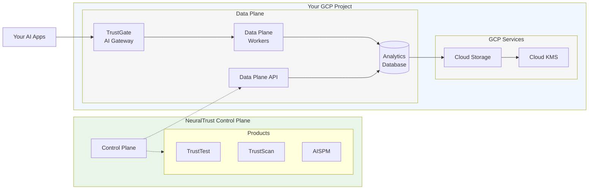

# Deploy NeuralTrust on Google Cloud Platform

NeuralTrust provides **global deployment** across all Google Cloud regions while ensuring your data never leaves your GCP project. We handle all infrastructure complexity while maintaining the highest security standards for enterprise AI monitoring, providing a fully managed service that combines the benefits of cloud-scale infrastructure with complete data sovereignty.

Our GCP deployment model ensures that your sensitive AI monitoring data remains within your GCP environment at all times, while benefiting from NeuralTrust's expertise in infrastructure management, security hardening, and operational excellence. This approach provides the optimal balance of control, security, and convenience for enterprise AI monitoring deployments.

## Architecture Overview



**Key Architecture Benefits:**
- **🔒 Data Sovereignty**: All your data stays in your GCP project
- **⚡ Automated Setup**: VPC, GKE, Storage, KMS automatically created
- **🛡️ Zero Trust**: TrustGate validates all AI traffic before processing

## Global Deployment Capabilities

### Universal Google Cloud Region Support

NeuralTrust supports deployment in **ALL commercial Google Cloud regions worldwide** with no exceptions, providing global coverage that enables organizations to deploy AI monitoring infrastructure close to their users and data sources while meeting data residency requirements.

| Region Group | Regions | Description |
|--------------|---------|-------------|
| **Americas** | **US**: us-central1 (Iowa), us-east1 (S. Carolina), us-east4 (N. Virginia), us-west1 (Oregon), us-west2 (Los Angeles), us-west3 (Salt Lake City), us-west4 (Las Vegas)<br/>**Canada**: northamerica-northeast1 (Montreal), northamerica-northeast2 (Toronto)<br/>**South America**: southamerica-east1 (São Paulo), southamerica-west1 (Santiago) | Complete coverage across North and South America |
| **Europe** | **EU West**: europe-west1 (Belgium), europe-west2 (London), europe-west3 (Frankfurt), europe-west4 (Netherlands), europe-west6 (Zurich), europe-west8 (Milan), europe-west9 (Paris)<br/>**EU Central**: europe-central2 (Warsaw)<br/>**EU North**: europe-north1 (Finland) | Full European coverage for GDPR compliance |
| **Asia Pacific** | **AP Southeast**: asia-southeast1 (Singapore), asia-southeast2 (Jakarta)<br/>**AP Northeast**: asia-northeast1 (Tokyo), asia-northeast2 (Osaka), asia-northeast3 (Seoul)<br/>**AP South**: asia-south1 (Mumbai), asia-south2 (Delhi)<br/>**Australia**: australia-southeast1 (Sydney), australia-southeast2 (Melbourne) | Comprehensive Asia-Pacific regional support |

### Regional Capabilities and Features

**Global Google Cloud Region Support:**
NeuralTrust supports deployment across all current Google Cloud commercial regions with automatic availability for new regions as they launch.

**Data Residency and Compliance:**
- **Regional Data Processing**: Choose your preferred region for primary data processing while maintaining data locality within specified geographic boundaries
- **Multi-Regional Storage**: Optional encrypted multi-regional replication for disaster recovery scenarios

**Unified Management:**
All regional deployments are managed through a single NeuralTrust console interface, providing centralized administration across multiple Google Cloud regions while maintaining regional data sovereignty.

## VPC and Infrastructure Creation

NeuralTrust automatically creates all required Google Cloud infrastructure during the deployment process, including VPC, subnets, security groups, and networking components.

### Automated Infrastructure Deployment

**What NeuralTrust Creates:**
- **VPC Network**: `/20` CIDR block (4,094 usable IPs) in your chosen region
- **Subnets**: Multi-zone public and private subnets for high availability
- **Networking**: Global Load Balancer, Cloud NAT, Route Tables, Firewall Rules
- **GKE Cluster**: Google Kubernetes Engine cluster with auto-scaling node pools
- **Load Balancers**: Global Load Balancer for TrustGate endpoints
- **Storage**: Cloud Storage buckets for backups and data rotation
- **Security**: Customer-managed Cloud KMS keys for encryption

**Network Architecture Created:**
```
Auto-Created VPC Network (10.0.0.0/20)
├── Public Subnets (for Load Balancer & Cloud NAT)
│   ├── us-central1-a: 10.0.1.0/24 (254 IPs)
│   └── us-central1-b: 10.0.2.0/24 (254 IPs)
└── Private Subnets (for GKE and Data Plane Components)
    ├── us-central1-a: 10.0.4.0/22 (1,022 IPs)
    └── us-central1-b: 10.0.8.0/22 (1,022 IPs)
```

**Security Configuration:**
- **Outbound**: HTTPS (443) to internet, internal communication within firewall rules
- **Inbound**: Only TrustGate API endpoints, no direct external access to private components

### Infrastructure Benefits

- **Zero Manual Setup**: No VPC or networking configuration required
- **Best Practices**: Enterprise-grade security and networking patterns
- **High Availability**: Multi-zone deployment for resilience
- **Scalability**: Auto-scaling capabilities for varying workloads

> **Note**: All infrastructure is created in your GCP project using your credentials, ensuring complete data sovereignty.

## Storage and Data Management

### Enterprise Storage Configuration

**Cloud Storage Data Management**
- **Daily Database Backups**: Automated daily backups of analytics database stored in Cloud Storage
- **Data Rotation**: Raw data rotated from analytics database to Cloud Storage after 6 months
- **Encrypted Storage**: All backups and rotated data encrypted with customer-managed keys
- **Lifecycle Management**: Automated archival and retention policies for both backups and rotated data

**Advanced Storage Security**
- **Bucket Policies**: Restrictive policies preventing unauthorized access
- **Versioning**: Complete version history
- **Object Lock**: Immutable storage for compliance requirements

### Data Lifecycle Management

**Data Retention and Rotation**
- **Analytics Database**: Real-time data stored for 6 months for active querying and analysis
- **Cloud Storage Rotation**: After 6 months, data automatically rotated from analytics database to Cloud Storage
- **Long-term Storage**: Cloud Storage provides cost-effective long-term retention with encryption
- **Compliance Retention**: Configurable retention periods to meet regulatory requirements

**Backup and Recovery**
- **Daily Database Backups**: Automated daily backups to Cloud Storage with encryption
- **Recovery Options**: Restore from any daily backup within retention period
- **Storage Backup Protection**: Versioning and object lock for all backup data
- **Automated Testing**: Monthly disaster recovery validation
- **RTO/RPO Guarantees**: 4-hour recovery time

## Data Plane Installation Guide

### Prerequisites

Before beginning the Data Plane installation, ensure you have the following:

**GCP Project Setup:**
- Google Cloud project with billing enabled
- gcloud CLI configured with appropriate credentials

**NeuralTrust Account:**
- Active NeuralTrust enterprise account
- Access to NeuralTrust Admin Portal
- Control Plane access credentials

### Step 1: Service Account Configuration

**1.1 Create Service Account**

```bash
# Set project variables
PROJECT_ID="your-project-id"
SERVICE_ACCOUNT_NAME="neuraltrust-dataplane-user"

# Create service account
gcloud iam service-accounts create $SERVICE_ACCOUNT_NAME \
    --display-name "NeuralTrust Data Plane User" \
    --description "Service account for NeuralTrust Data Plane deployment" \
    --project $PROJECT_ID
```

**1.2 Assign Required Roles**

```bash
# Core infrastructure roles
gcloud projects add-iam-policy-binding $PROJECT_ID \
    --member "serviceAccount:$SERVICE_ACCOUNT_NAME@$PROJECT_ID.iam.gserviceaccount.com" \
    --role "roles/compute.admin"

gcloud projects add-iam-policy-binding $PROJECT_ID \
    --member "serviceAccount:$SERVICE_ACCOUNT_NAME@$PROJECT_ID.iam.gserviceaccount.com" \
    --role "roles/container.admin"

gcloud projects add-iam-policy-binding $PROJECT_ID \
    --member "serviceAccount:$SERVICE_ACCOUNT_NAME@$PROJECT_ID.iam.gserviceaccount.com" \
    --role "roles/storage.admin"

gcloud projects add-iam-policy-binding $PROJECT_ID \
    --member "serviceAccount:$SERVICE_ACCOUNT_NAME@$PROJECT_ID.iam.gserviceaccount.com" \
    --role "roles/cloudkms.admin"

# Monitoring and security roles
gcloud projects add-iam-policy-binding $PROJECT_ID \
    --member "serviceAccount:$SERVICE_ACCOUNT_NAME@$PROJECT_ID.iam.gserviceaccount.com" \
    --role "roles/monitoring.admin"

gcloud projects add-iam-policy-binding $PROJECT_ID \
    --member "serviceAccount:$SERVICE_ACCOUNT_NAME@$PROJECT_ID.iam.gserviceaccount.com" \
    --role "roles/logging.admin"

gcloud projects add-iam-policy-binding $PROJECT_ID \
    --member "serviceAccount:$SERVICE_ACCOUNT_NAME@$PROJECT_ID.iam.gserviceaccount.com" \
    --role "roles/secretmanager.admin"
```

**1.3 Create Service Account Key**

```bash
# Create and download service account key
gcloud iam service-accounts keys create neuraltrust-key.json \
    --iam-account $SERVICE_ACCOUNT_NAME@$PROJECT_ID.iam.gserviceaccount.com
```

Save the **service account key file** securely. You'll provide this credential in the NeuralTrust Admin Portal.

### Step 2: Customer-Managed KMS Keys

**2.1 Create KMS Keyring and Key**

```bash
# Set region and keyring variables
REGION="us-central1"
KEYRING_NAME="neuraltrust-dataplane-keyring"
KEY_NAME="neuraltrust-dataplane-key"

# Create KMS keyring
gcloud kms keyrings create $KEYRING_NAME \
    --location $REGION \
    --project $PROJECT_ID

# Create encryption key
gcloud kms keys create $KEY_NAME \
    --keyring $KEYRING_NAME \
    --location $REGION \
    --purpose encryption \
    --project $PROJECT_ID
```

### Step 3: Deploy Data Plane via Admin Portal

**3.1 Access NeuralTrust Admin Portal**

1. Log into your NeuralTrust account at [https://portal.neuraltrust.ai](https://portal.neuraltrust.ai)
2. Navigate to **Data Plane** → **Deployments**
3. Click **"New Data Plane Deployment"**

**3.2 Configure Deployment Settings**

In the Admin Portal, provide the following information:

**GCP Configuration:**
- **Project ID**: Your Google Cloud project ID
- **Service Account Key**: Upload the JSON key file created in Step 1
- **GCP Region**: Your chosen deployment region (e.g., `us-central1`)

**Data Plane Settings:**
- **Environment Name**: `production` (or your preferred name)
- **Instance Type**: `e2-standard-4` (recommended for production)
- **Min/Max Nodes**: Configure auto-scaling parameters
- **Data Retention**: 90 days (configurable)

**3.3 Initiate Deployment**

1. Review all configuration settings
2. Click **"Deploy Data Plane"**
3. Monitor deployment progress in real-time through the portal
4. Deployment typically takes 15-20 minutes

### Step 4: Verify Deployment

**4.1 Check Deployment Status**

Monitor the deployment through the Admin Portal:
- **Infrastructure Status**: All components show "Healthy"
- **TrustGate Services**: Both Admin and Gateway services running
- **Data Processing**: Workers and queue operational
- **Database**: Connection established and healthy

**4.2 Test Connectivity**

The portal provides built-in connectivity tests:
1. **Control Plane Connection**: Verify secure connection to NeuralTrust
2. **Internal Communication**: Test Data Plane component connectivity
3. **External Access**: Validate TrustGate endpoint accessibility

### Verification Checklist

**✅ Pre-Deployment Verification**
- [ ] Service account created with correct permissions
- [ ] KMS keyring and encryption keys configured
- [ ] Admin Portal access confirmed

**✅ Deployment Verification**
- [ ] All Data Plane components deployed successfully
- [ ] TrustGate services healthy and accessible
- [ ] Connection to Control Plane established
- [ ] Monitoring and logging active

**✅ Application Integration**
- [ ] AI applications configured to use TrustGate
- [ ] End-to-end data flow tested
- [ ] Security policies validated
- [ ] Performance monitoring enabled

### Troubleshooting

**Common Issues and Solutions:**

**Deployment Failures:**
- Check service account permissions in GCP console
- Verify project quota limits
- Ensure KMS key accessibility

**Connectivity Issues:**
- Validate VPC firewall rules
- Check Global Load Balancer configuration
- Verify DNS resolution

**Permission Errors:**
- Review IAM role assignments
- Confirm service account key validity
- Check KMS key permissions

### Support

For deployment assistance:
- **Technical Support**: support@neuraltrust.ai
- **Documentation**: https://docs.neuraltrust.ai/dataplane/gcp

---

> **🔒 Security Guarantee**: Your data never leaves your GCP environment. NeuralTrust provides enterprise-grade AI monitoring with military-grade security, complete data sovereignty, and global deployment capabilities across all Google Cloud regions. 