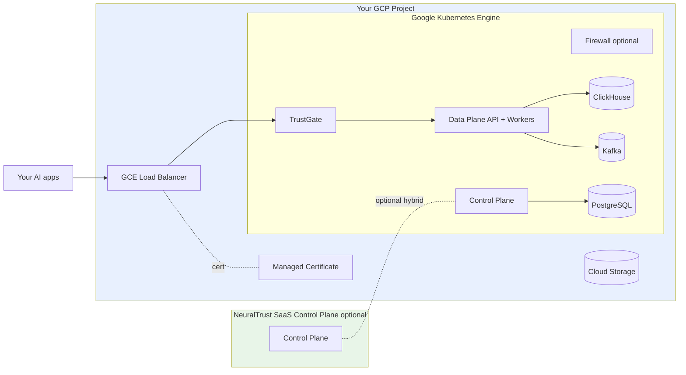

NeuralTrust Platform runs on Google Kubernetes Engine using GCP-native primitives — GCE Ingress with managed certificates, Persistent Disk storage, and Cloud DNS. GCP is the default platform target — the chart's defaults assume GCP unless you override `global.platform`.

For the cross-platform install workflow, start with [Install on Kubernetes](./kubernetes).

## Architecture



All workloads run inside your GCP project and VPC. Data never leaves your environment.

## Cluster prerequisites

| Resource | Recommended starting point |
|---|---|
| GKE version | 1.28 or newer |
| Cluster mode | Standard or Autopilot (Standard recommended for GPU workloads) |
| Worker machine type | `e2-standard-4` or `n2-standard-4` (4 vCPU / 16 GiB) |
| Min nodes | 3 across at least 2 zones (regional cluster) |
| Storage | `pd-balanced` or `pd-ssd` storage class |
| Ingress | GCE Ingress (default) with Managed Certificates, or NGINX |
| DNS | Cloud DNS (or any DNS provider) for the platform base domain |

For GPU Firewall workers, add a GPU node pool (`nvidia-l4` or `nvidia-t4`) with the GKE GPU device plugin. See [Firewall deployment › GPU](./firewall#enable-the-firewall).

### Required cluster setup

```bash
# Create a regional GKE Standard cluster
gcloud container clusters create neuraltrust \
  --region <REGION> \
  --num-nodes 1 \
  --machine-type e2-standard-4 \
  --release-channel regular

# Get credentials
gcloud container clusters get-credentials neuraltrust --region <REGION>
```

GCE Ingress and Persistent Disk CSI driver are enabled by default on GKE.

## Install the Helm chart on GKE

<Steps>
  <Step title="Configure kubectl for the GKE cluster">
    ```bash
    gcloud container clusters get-credentials neuraltrust --region <REGION>
    kubectl get nodes
    ```
  </Step>

  <Step title="Create the namespace and image pull secret">
    ```bash
    kubectl create namespace neuraltrust

    kubectl create secret docker-registry gcr-secret \
      --docker-server=europe-west1-docker.pkg.dev \
      --docker-username=_json_key \
      --docker-password="$(cat path/to/gcr-keys.json)" \
      --docker-email=admin@neuraltrust.ai \
      -n neuraltrust
    ```
  </Step>

  <Step title="Install with the GCP platform selector (default)">
    ```bash
    helm upgrade --install neuraltrust-platform \
      oci://europe-west1-docker.pkg.dev/neuraltrust-app-prod/helm-charts/neuraltrust-platform \
      --version <VERSION> \
      --namespace neuraltrust \
      --set global.platform=gcp \
      --set global.domain=platform.example.com \
      --set global.storageClass=pd-balanced
    ```

    `global.platform=gcp` is the chart default and can be omitted if you want.
  </Step>

  <Step title="Point DNS at the load balancer">
    ```bash
    kubectl get ingress -n neuraltrust -o wide
    ```

    Get the GCE load balancer IP from each Ingress and create A records in Cloud DNS for every platform host (`app.<domain>`, `data-plane-api.<domain>`, etc.).
  </Step>
</Steps>

## GCP-specific configuration

### Managed certificates

GCP Managed Certificates issue and renew certs automatically against domains validated through Cloud DNS:

```yaml
trustgate:
  ingress:
    enabled: true
    annotations:
      kubernetes.io/ingress.class: "gce"
      networking.gke.io/managed-certificates: "trustgate-cert"
      networking.gke.io/v1beta1.FrontendConfig: "trustgate-fc"
```

Create the `ManagedCertificate` and `FrontendConfig` separately:

```yaml
apiVersion: networking.gke.io/v1
kind: ManagedCertificate
metadata:
  name: trustgate-cert
  namespace: neuraltrust
spec:
  domains:
    - trustgate.platform.example.com
---
apiVersion: networking.gke.io/v1beta1
kind: FrontendConfig
metadata:
  name: trustgate-fc
  namespace: neuraltrust
spec:
  redirectToHttps:
    enabled: true
```

### Storage class

```yaml
global:
  storageClass: "pd-balanced"   # cost / perf default
  # storageClass: "pd-ssd"      # SSD for high-throughput ClickHouse
```

Per-component override:

```yaml
clickhouse:
  persistence:
    storageClass: "pd-ssd"
    size: 200Gi
```

### Internal-only ingress

For VPC-internal endpoints (Internal HTTP(S) Load Balancer):

```yaml
trustgate:
  ingress:
    annotations:
      kubernetes.io/ingress.class: "gce-internal"
```

### Network Endpoint Groups (NEG) and Private Service Connect

For container-native load balancing or PSC-published endpoints:

```yaml
trustgate:
  service:
    annotations:
      cloud.google.com/neg: '{"ingress": true}'
```

PSC-specific configuration is environment-dependent — work with your Google Cloud architect to plan the producer/consumer side.

### GPU node pool for Firewall workers

```bash
gcloud container node-pools create gpu-pool \
  --cluster neuraltrust --region <REGION> \
  --machine-type g2-standard-4 \
  --accelerator type=nvidia-l4,count=1,gpu-driver-version=latest \
  --num-nodes 1 \
  --node-taints nvidia.com/gpu=true:NoSchedule
```

```yaml
neuraltrust-firewall:
  firewall:
    enabled: true
    workerDefaults:
      image:
        repository: "europe-west1-docker.pkg.dev/.../firewall-gpu"
      resources:
        limits:
          nvidia.com/gpu: "1"
      nodeSelector:
        cloud.google.com/gke-accelerator: "nvidia-l4"
      tolerations:
        - key: "nvidia.com/gpu"
          operator: "Exists"
          effect: "NoSchedule"
      hostIPC: true
```

Full reference: [Firewall deployment](./firewall).

## Region availability

NeuralTrust runs in any GCP region with GKE support. Choose the region closest to your application traffic and target LLM endpoints, or one that meets your data-residency obligations. The chart and images are region-agnostic.

For Assured Workloads or specific sovereign-cloud requirements, contact [support@neuraltrust.ai](mailto:support@neuraltrust.ai).

## Backup and data lifecycle

For production, configure backups against the persistent stores rather than relying on Persistent Disk snapshots alone:

- **PostgreSQL**: Use Cloud SQL for PostgreSQL externally with built-in automated backups, and set `neuraltrust-control-plane.infrastructure.postgresql.deploy: false`.
- **ClickHouse**: Use ClickHouse `BACKUP` to Cloud Storage, or ClickHouse Cloud externally with `infrastructure.clickhouse.deploy: false`.
- **Kafka**: For higher availability, use Confluent Cloud and set `infrastructure.kafka.deploy: false`.

Pointing the chart at managed GCP data services is documented in [Configuration scenarios › External infrastructure only](./configuration#external-infrastructure-only).

## Verification

```bash
kubectl get pods -n neuraltrust
kubectl get ingress -n neuraltrust -o wide
kubectl get managedcertificate -n neuraltrust   # if using Managed Certificates

curl https://data-plane-api.platform.example.com/health
curl https://control-plane-api.platform.example.com/health
```

## Troubleshooting

### Ingress doesn't get an IP

```bash
kubectl describe ingress -n neuraltrust <ingress-name>
```

Common causes: missing BackendConfig, NEG annotation mismatch, or quota exhausted on the project's regional load balancer pool.

### Managed certificate stuck `Provisioning`

```bash
kubectl describe managedcertificate -n neuraltrust trustgate-cert
```

Provisioning requires DNS to already point at the load balancer. Confirm the A record resolves before adding the cert annotation.

### PVCs stuck in `Pending`

```bash
kubectl describe pvc -n neuraltrust <pvc-name>
```

Verify the storage class exists and the cluster has quota for the requested disk type.

### `ImagePullBackOff`

Recreate `gcr-secret` with the JSON key from NeuralTrust. See [Install on Kubernetes › Common issues](./kubernetes#common-issues).

## Related guides

- [Install on Kubernetes](./kubernetes) — full install workflow
- [Configuration scenarios](./configuration) — values files for common topologies
- [Secrets management](./secrets) — auto-generation and external secret stores
- [Firewall deployment](./firewall) — GPU workers on GKE
