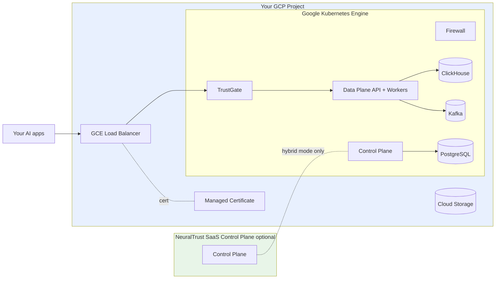

NeuralTrust Platform runs on Google Kubernetes Engine using GCP-native primitives — GCE Ingress with Managed Certificates, Persistent Disk for storage, Workload Identity for IAM, and Cloud DNS for hostnames. GCP is the chart's **default platform target** (`global.platform: gcp`).

## Pick your path

<CardGroup cols={2}>
  <Card title="Hybrid (recommended)" icon="cloud" href="./hybrid">
    Data Plane + TrustGate + Firewall in your GKE cluster. Control Plane runs on NeuralTrust SaaS. Fastest to first dashboard.
  </Card>
  <Card title="Self-hosted" icon="shield" href="./self-hosted">
    Full stack including Control Plane API, UI, and Scheduler in your GKE cluster. For sovereignty and air-gapped requirements.
  </Card>
</CardGroup>

If you're unsure which model fits your environment, see [Deployment models](../deployment-models).

## Cluster prerequisites

| Resource | Recommended starting point |
|---|---|
| GKE version | 1.28 or newer |
| Cluster mode | Standard or Autopilot *(Standard recommended for GPU workloads)* |
| CPU pool machine type | `e2-standard-8` or `n2-standard-8` (8 vCPU / 32 GiB) |
| Min CPU nodes | **4 for hybrid (CPU Firewall)**, **5 for self-hosted (CPU Firewall)**. Subtract one when using GPU Firewall workers. ≥ 3 zones for HA. |
| GPU pool *(optional)* | `n1-standard-4` + 1 × T4 — 5 nodes (one per default Firewall worker) |
| Storage | `pd-balanced` (default) or `pd-ssd` for ClickHouse |
| Ingress | GCE Ingress (default) with Managed Certificates, or NGINX |
| DNS | Cloud DNS or any DNS provider for the platform base domain |
| Container Registry | NeuralTrust ships images from `europe-west1-docker.pkg.dev` |

Smaller `e2-standard-4` (4 vCPU / 16 GiB) workers also work but require 7–8 nodes to fit the same workload. See [Deployment models › Sizing baseline](../deployment-models#sizing-baseline) for the math.

For GPU Firewall workers, add a GPU node pool with `g2-standard-4` (NVIDIA L4) or equivalent. See [Firewall deployment › GPU](../firewall#enable-the-firewall) for details.

### Required cluster setup

```bash
# Regional GKE Standard cluster (1 node per zone × 3 zones × default = 3 nodes)
gcloud container clusters create neuraltrust \
  --region <REGION> \
  --num-nodes 2 \
  --machine-type e2-standard-8 \
  --release-channel regular

# Configure kubectl
gcloud container clusters get-credentials neuraltrust --region <REGION>
```

`--num-nodes` is per-zone in a regional cluster — `2` × 3 zones = 6 worker nodes, which fits the hybrid topology with breathing room. Drop to `1` per zone (= 3 nodes) only if you're moving Firewall workers onto a separate GPU node pool.

GCE Ingress, Managed Certificates, and the Persistent Disk CSI driver are all enabled by default on GKE.

## Architecture



All workloads run inside your GCP project and VPC. Data never leaves your environment.

## GCP-specific defaults

When `global.platform: "gcp"` (the chart default):

- **Ingress class**: GCE (via `kubernetes.io/ingress.class: gce`).
- **TLS**: prefers GCP Managed Certificates via `networking.gke.io/managed-certificates`. When no cert is configured, the chart provisions a self-signed `kubernetes.io/tls` secret.
- **Service annotations**: NEG enabled (`cloud.google.com/neg: '{"ingress": true}'`) for container-native load balancing.
- **Static IPs**: per-service `global-static-ip-name` annotation respected when set.
- **PSC**: optional via `global.psc.negNames` for Private Service Connect.

## Common configuration

### Storage class

```yaml
global:
  storageClass: "pd-balanced"        # default — balanced cost / perf
  # storageClass: "pd-ssd"           # SSD for high-throughput ClickHouse
```

Per-component override for ClickHouse on `pd-ssd`:

```yaml
clickhouse:
  persistence:
    storageClass: "pd-ssd"
    size: 200Gi
```

### Managed Certificates

GCP Managed Certificates issue and renew TLS certs automatically. Reference one from your ingress:

```yaml
trustgate:
  ingress:
    enabled: true
    annotations:
      kubernetes.io/ingress.class: "gce"
      networking.gke.io/managed-certificates: "trustgate-cert"
      networking.gke.io/v1beta1.FrontendConfig: "trustgate-fc"
```

Create the `ManagedCertificate` and `FrontendConfig`:

```yaml
apiVersion: networking.gke.io/v1
kind: ManagedCertificate
metadata:
  name: trustgate-cert
  namespace: neuraltrust
spec:
  domains:
    - trustgate.platform.example.com
---
apiVersion: networking.gke.io/v1beta1
kind: FrontendConfig
metadata:
  name: trustgate-fc
  namespace: neuraltrust
spec:
  redirectToHttps:
    enabled: true
```

<Note>
Managed Certificate provisioning requires DNS to **already** resolve to the load balancer. Provision DNS first, then add the cert annotation, then upgrade Helm.
</Note>

### Internal-only ingress

For VPC-internal endpoints using the Internal HTTP(S) Load Balancer:

```yaml
trustgate:
  ingress:
    annotations:
      kubernetes.io/ingress.class: "gce-internal"
```

### Network Endpoint Groups (NEG) and Private Service Connect

For container-native load balancing or PSC-published endpoints:

```yaml
trustgate:
  service:
    annotations:
      cloud.google.com/neg: '{"ingress": true}'
```

PSC is environment-specific — work with your Cloud Architect to plan the producer / consumer setup.

### GPU node pool for Firewall workers

```bash
gcloud container node-pools create gpu-pool \
  --cluster neuraltrust --region <REGION> \
  --machine-type g2-standard-4 \
  --accelerator type=nvidia-l4,count=1,gpu-driver-version=latest \
  --num-nodes 1 \
  --node-taints nvidia.com/gpu=true:NoSchedule
```

Then enable the Firewall with GPU workers (see [Firewall deployment](../firewall)).

## Region availability

NeuralTrust runs in any GCP region with GKE support. Choose the region closest to your application traffic and target LLM endpoints, or one that meets your data-residency obligations.

For Assured Workloads or specific sovereign-cloud requirements, contact [support@neuraltrust.ai](mailto:support@neuraltrust.ai).

## Backup and data lifecycle

For production, configure backups against the persistent stores rather than relying on Persistent Disk snapshots alone:

- **PostgreSQL**: use Cloud SQL for PostgreSQL externally and set `neuraltrust-control-plane.infrastructure.postgresql.deploy: false`.
- **ClickHouse**: use `clickhouse.backup.enabled: true` to back up to GCS (S3-compatible endpoint `https://storage.googleapis.com/<bucket>/<prefix>`), or run ClickHouse Cloud externally.
- **Kafka**: use Confluent Cloud and set `infrastructure.kafka.deploy: false`.

Pointing the chart at managed GCP data services is documented in [Configuration scenarios › External infrastructure](../configuration#external-infrastructure-only).

## Verification

```bash
kubectl get pods -n neuraltrust
kubectl get ingress -n neuraltrust -o wide
kubectl get managedcertificate -n neuraltrust   # if using Managed Certificates

# Health checks (replace with your domain)
curl https://data-plane-api.platform.example.com/health
```

## Common issues

| Symptom | Likely cause | Fix |
|---|---|---|
| Ingress doesn't get an IP | Missing BackendConfig or NEG annotation mismatch | Check ingress events with `kubectl describe ingress` |
| Managed Certificate stuck `Provisioning` | DNS not yet pointing at LB | Confirm A record resolves, then wait 10–60 minutes |
| `PVC` stuck `Pending` | Wrong / missing storage class | `kubectl get storageclass`; confirm cluster quota |
| `ImagePullBackOff` | Missing or wrong `gcr-secret` | Recreate with the JSON key from NeuralTrust |

## Next steps

- [Hybrid deployment on GKE](./hybrid) — Data Plane only, Control Plane on SaaS
- [Self-hosted deployment on GKE](./self-hosted) — full stack including CP
- [Deployment models](../deployment-models) — hybrid vs self-hosted in depth
- [Feature flags reference](../feature-flags) — local vs external Postgres/Redis/Kafka/CH, image registry, storage, secrets
- [Image catalog](../images) — what runs where
- [Firewall deployment](../firewall) — GPU workers on GKE
