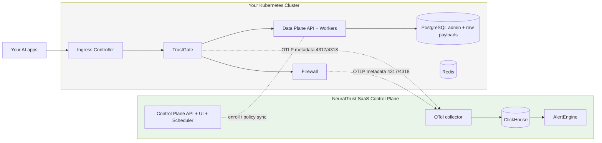

NeuralTrust Platform runs on any Kubernetes 1.24+ distribution — managed clouds, on-prem clusters, bare metal, k3s / RKE2, IBM Cloud Kubernetes Service, Oracle OKE, Civo, DigitalOcean Kubernetes, and so on. This guide covers the **cloud-agnostic** path; if you're on EKS / AKS / GKE / OpenShift, use the dedicated guide for richer integrations:

- [AWS (EKS)](../aws/overview)
- [Azure (AKS)](../azure/overview)
- [GCP (GKE)](../gcp/overview)
- [OpenShift](../openshift/overview)

## Pick your path

<CardGroup cols={2}>
  <Card title="Hybrid" icon="cloud" href="./hybrid">
    Data Plane + TrustGate + Firewall in your cluster. Control Plane runs on NeuralTrust SaaS. Fastest to first dashboard.
  </Card>
</CardGroup>

If you're unsure which model fits your environment, see [Deployment models](../deployment-models).

## Cluster prerequisites

| Resource | Recommended |
|---|---|
| Kubernetes version | 1.24+ |
| CPU pool node spec | **8 vCPU / 32 GiB recommended**; **≥ 4 nodes (CPU Firewall)**. Subtract one when using GPU Firewall workers. |
| GPU pool *(optional)* | 4 vCPU / 16 GiB + 1 × NVIDIA GPU per node — 5 nodes (one per default Firewall worker) |
| Storage class | A default `StorageClass` with `ReadWriteOnce` PV provisioning (`local-path`, Longhorn, Rook/Ceph, NFS CSI, etc.) |
| Ingress controller | [NGINX](https://kubernetes.github.io/ingress-nginx/), [Traefik](https://traefik.io/traefik/), [HAProxy](https://www.haproxy.com/documentation/haproxy-enterprise-kubernetes-ingress-controller/), or any conformant ingress |
| TLS | [cert-manager](https://cert-manager.io/) with Let's Encrypt or internal CA, or pre-existing TLS secrets |
| DNS | Any DNS provider that can resolve your domain to the ingress LB/node IPs |
| Image pull | `gcr-secret` (docker-registry) with `gcr-keys.json` from NeuralTrust, OR a mirrored internal registry |
| Optional | NVIDIA device plugin for GPU Firewall workers |

### Required cluster setup

<Tabs>
  <Tab title="NGINX + cert-manager">
    ```bash
    # NGINX ingress
    helm repo add ingress-nginx https://kubernetes.github.io/ingress-nginx
    helm install ingress-nginx ingress-nginx/ingress-nginx \
      -n ingress-nginx --create-namespace

    # cert-manager
    helm repo add jetstack https://charts.jetstack.io
    helm install cert-manager jetstack/cert-manager \
      -n cert-manager --create-namespace \
      --set installCRDs=true
    ```

    Create a `ClusterIssuer`:

    ```yaml
    apiVersion: cert-manager.io/v1
    kind: ClusterIssuer
    metadata:
      name: letsencrypt-prod
    spec:
      acme:
        server: https://acme-v02.api.letsencrypt.org/directory
        email: ops@example.com
        privateKeySecretRef:
          name: letsencrypt-prod-key
        solvers:
          - http01:
              ingress:
                class: nginx
    ```
  </Tab>
  <Tab title="Traefik">
    ```bash
    helm repo add traefik https://helm.traefik.io/traefik
    helm install traefik traefik/traefik \
      -n traefik --create-namespace \
      --set ports.web.redirectTo=websecure \
      --set certificatesResolvers.letsencrypt.acme.email=ops@example.com \
      --set certificatesResolvers.letsencrypt.acme.httpChallenge.entryPoint=web \
      --set certificatesResolvers.letsencrypt.acme.storage=/data/acme.json
    ```
  </Tab>
  <Tab title="MetalLB (bare metal)">
    For bare-metal clusters without a cloud LB, install MetalLB to provide LoadBalancer service IPs:

    ```bash
    kubectl apply -f https://raw.githubusercontent.com/metallb/metallb/v0.14.5/config/manifests/metallb-native.yaml
    ```

    Then create an `IPAddressPool` for your IP range. After MetalLB is configured, NGINX/Traefik will receive an IP automatically.
  </Tab>
</Tabs>

## Architecture



TrustGate, Firewall, and your Postgres/Redis run inside your cluster. Only OTLP metadata and control-plane sync leave the cluster (to the NeuralTrust SaaS collector on 4317/4318); raw prompts and responses stay in your in-cluster PostgreSQL. The OTel collector, ClickHouse, and AlertEngine all run on NeuralTrust SaaS.

## Kubernetes-specific defaults

When `global.platform: "kubernetes"`:

- **Ingress class**: not set automatically — you set `className` per ingress (typically `nginx`, `traefik`, etc.).
- **No cloud annotations** are applied automatically. You can add any annotations through `ingress.annotations`.
- **TLS**: when a per-ingress `secretName` is set, the chart references it directly; when not set and `global.ingress.tls.autoGenerate: true` (default), the chart creates a shared self-signed `kubernetes.io/tls` secret.
- **Storage class**: uses the cluster default unless you set `global.storageClass`.

## Common configuration

### Ingress with cert-manager

```yaml
trustgate:
  ingress:
    enabled: true
    className: "nginx"
    annotations:
      cert-manager.io/cluster-issuer: "letsencrypt-prod"
      nginx.ingress.kubernetes.io/ssl-redirect: "true"
```

### Pre-existing TLS secret

```yaml
trustgate:
  ingress:
    enabled: true
    className: "nginx"
    tls:
      secretName: "wildcard-platform-example-com"
```

Make sure the Secret exists in the `neuraltrust` namespace.

### Storage class

```yaml
global:
  storageClass: "local-path"           # k3s default
  # storageClass: "longhorn"           # Rancher Longhorn
  # storageClass: "rook-ceph-block"    # Rook/Ceph
  # storageClass: "nfs-client"         # NFS CSI
```

### GPU node label for Firewall workers

```bash
kubectl label nodes <gpu-node-name> gpu-node-pool=gpu-pool
```

Install the [NVIDIA device plugin](https://github.com/NVIDIA/k8s-device-plugin), then enable Firewall GPU workers (see [Firewall deployment](../firewall)).

## Backup and data lifecycle

Because there's no cloud-managed backup story on vanilla Kubernetes, choose an explicit backup strategy:

- **PostgreSQL**: schedule `pg_dump` CronJobs to your S3-compatible object store, or use [CloudNativePG](https://cloudnative-pg.io/) for built-in PITR. This store holds TrustGate admin metadata **and** the raw prompt/response payloads.
- **Redis**: back up if you use it as more than an ephemeral cache; otherwise it can be rebuilt.
- **PVC snapshots**: use [Velero](https://velero.io/) with restic for cluster-wide backup and DR.

ClickHouse and the AlertEngine run on NeuralTrust SaaS — there is nothing to back up for them in your cluster.

External-infra reference: [Configuration scenarios](../configuration#external-infrastructure-only).

## Verification

```bash
kubectl get pods -n neuraltrust
kubectl get ingress -n neuraltrust -o wide

curl https://data-plane-api.platform.example.com/health
```

## Common issues

| Symptom | Likely cause | Fix |
|---|---|---|
| Ingress IP `pending` | No LB controller / MetalLB on bare metal | Install MetalLB or expose ingress via NodePort + external proxy |
| `PVC` stuck `Pending` | No default storage class | `kubectl get storageclass`; mark one default with `storageclass.kubernetes.io/is-default-class=true` |
| cert-manager challenge fails | DNS not resolving, or HTTP-01 challenge can't reach ingress | Check `kubectl get certificate -A` and `kubectl describe challenge` |
| `ImagePullBackOff` | `gcr-secret` missing or wrong | Recreate with the JSON key from NeuralTrust; or use a mirrored internal registry |
| Pods OOMKilled | Under-sized nodes | Raise node spec; deploy to dedicated nodes with `nodeSelector` |

## Next steps

- [Hybrid deployment on vanilla Kubernetes](./hybrid) — Data Plane only, Control Plane on SaaS
- [Deployment models](../deployment-models) — SaaS vs Hybrid comparison
- [Feature flags reference](../feature-flags) — local vs external Postgres/Redis, image registry, storage, secrets
- [Image catalog](../images) — what runs where, including internal-registry mirroring
- [Firewall deployment](../firewall) — GPU workers on vanilla Kubernetes
- [Secrets management](../secrets) — auto-generation, External Secrets Operator
