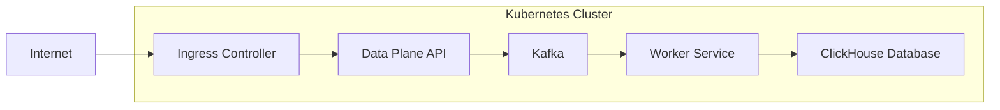

# NeuralTrust Infrastructure

This repository contains the infrastructure code for [NeuralTrust](https://neuraltrust.ai), a comprehensive platform designed to monitor, secure, and analyze AI interactions.

## Architecture

NeuralTrust is structured into two primary components:

1. **Data Plane**: Manages data ingestion, processing, and storage. It comprises:

   - **API Service**: Serves as the entry point for incoming telemetry data from client applications. It validates, processes, and forwards this data to the appropriate backend services.

   - **ClickHouse Database**: A high-performance columnar database optimized for analytical queries, used to store processed telemetry data, enabling efficient retrieval and analysis.

   - **Kafka**: A distributed event streaming platform that decouples data ingestion from processing. It ensures reliable message delivery between services, allowing the system to handle high-throughput data streams.

   - **Worker Service**: Performs background tasks such as data enrichment, anomaly detection, and other asynchronous processing jobs. It consumes messages from Kafka, processes them, and stores the results in ClickHouse or other storage systems as needed.

2. **Control Plane**: Provides the user interface and management API for overseeing applications. It includes:

   - **Web Application**: A user-friendly interface that allows users to configure settings, view analytics, and manage their applications.

   - **API Service**: Handles business logic and serves as an intermediary between the web application and the underlying data stores.

   - **PostgreSQL Database**: Stores application metadata, user configurations, and other relational data required for the Control Plane's operations.

> **Note**: The Control Plane is hosted and managed by [NeuralTrust](https://neuraltrust.ai) and does not require installation or maintenance by users.

## Connectivity

### Network Requirements

The NeuralTrust architecture has specific connectivity needs:

1. **Data Plane API**: This is the sole component that requires exposure to the public internet for two main purposes:

   - **Receiving Telemetry Data**: Client applications, integrated with the NeuralTrust SDK, send telemetry data to the Data Plane API over HTTPS.

   - **Control Plane Communication**: The Control Plane connects to the Data Plane API to manage configurations, retrieve analytics, and perform other management tasks.

2. **Internal Components**: The following services are designed to operate within a secure, internal network and should not be exposed publicly:

   - **Kafka**: Handles internal message brokering between services.

   - **ClickHouse**: Stores analytical data and serves internal queries.

   - **Worker Service**: Processes background tasks and consumes messages from Kafka.

   - **Schema Registry**: Manages schemas for data serialization and deserialization, ensuring data compatibility across services.

### Network Diagram

Below is a simplified representation of the NeuralTrust architecture:

> NeuralTrust can provide IP allowlists to improve firewall security.

### Firewall Configuration

To ensure proper operation, configure your firewall to allow:

1. **Inbound HTTPS Traffic (Port 443)**: Direct this to the Kubernetes Ingress Controller to facilitate secure communication from client applications and the Control Plane.

2. **Outbound HTTPS Traffic (Port 443)**: Permit this from the Data Plane API to the Control Plane for management operations.

3. **Outbound HTTPS Traffic (Port 443)**: Allow this from the Worker Service to external AI services (e.g., OpenAI, HuggingFace) for tasks that require external data or processing.