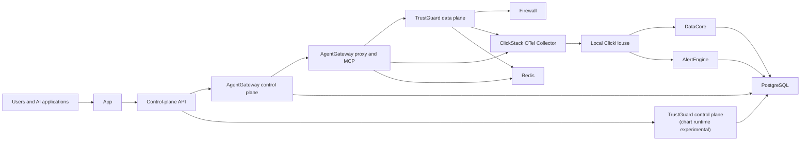

NeuralTrust supports **SaaS**, **Hybrid**, and **External** deployments. SaaS is operated by NeuralTrust. Hybrid and External use the `neuraltrust-platform` Helm chart; only those two values map to `global.deploymentMode`.

## SaaS and Hybrid architecture


This simplified topology focuses on the primary request, telemetry, and retrieval paths. The Hybrid `data-plane-api` compatibility shim is omitted.

In Hybrid, AgentGateway proxy/MCP, TrustGuard runtime, Firewall, `data-plane-api`, and optionally DataAgent run in the customer cluster. Their control planes, the app/control-plane API, DataBridge, SaaS ClickStack collector, ClickHouse, and AlertEngine remain on NeuralTrust SaaS.

The intended Hybrid contract exports **metadata only** over OTLP. Raw prompts and responses stay in the customer PostgreSQL, whether deployed in-cluster or provided as a managed service. DataAgent is enrollment-gated and performs authorized outbound retrieval from PostgreSQL through DataBridge when a user requests raw data. AgentGateway and TrustGuard configuration sync is optional and disabled by default in chart 2.0.5.

<Warning>
**Chart 2.0.5 compatibility deviation:** its Hybrid telemetry configuration exports raw payloads and metadata and requires a ClickStack token by default. Chart 2.0.5 cannot select metadata-only OTLP through values. The accurate choices are to accept its raw+metadata export, set `global.clickstack.enabled: false` to disable the entire SaaS ClickStack export path (both metadata and raw), or deploy an approved patched/newer chart that implements metadata-only export.
</Warning>

## External architecture



External is the supported self-hosted model. Both control and data planes run in your environment, along with the app, control-plane API, DataCore, ClickStack OTel Collector, ClickHouse, and AlertEngine. DataAgent/DataBridge are not used. Analytics and payload storage remain local unless you explicitly enable another export or integration.

<Warning>
Chart 2.0.5 renders External TrustGuard control-plane resources, but the subchart marks their arguments and ports as placeholders for an in-progress split. Validate that runtime against the exact TrustGuard image before production deployment.
</Warning>

## Workload placement

| Workload | SaaS | Hybrid customer cluster | External cluster |
| --- | --- | --- | --- |
| AgentGateway data plane (proxy/MCP), TrustGuard data plane | Hosted | Yes | Yes |
| AgentGateway and TrustGuard control planes | Hosted | SaaS | AgentGateway: yes; TrustGuard: rendered, runtime experimental |
| Firewall | Hosted | Optional, default on | Optional, default on |
| `data-plane-api` compatibility shim | N/A / undocumented | Yes | Yes |
| DataAgent / SaaS DataBridge | N/A | Optional / SaaS | No |
| App and control-plane API | Hosted | SaaS | Yes |
| ClickStack collector, ClickHouse, DataCore, AlertEngine | Hosted | SaaS | Yes |
| PostgreSQL and Redis | Hosted | Shared local or managed stores | Local or managed, with service-specific databases |

## Install chart 2.0.5

Start from the example matching your model:

```bash
cp values-v2-hybrid.yaml.example values-v2-hybrid.yaml
cp values-v2-external.yaml.example values-v2-external.yaml

helm upgrade --install neuraltrust-platform \
  oci://europe-west1-docker.pkg.dev/neuraltrust-app-prod/helm-charts/neuraltrust-platform \
  --version 2.0.5 \
  --namespace neuraltrust --create-namespace \
  -f values-v2-hybrid.yaml
```

Edit the copied file for the target environment. Use `values-v2-external.yaml` for External. See [Configuration](/neuraltrust/deployment/configuration), [Secrets](/neuraltrust/deployment/secrets), and your [provider guide](#provider-guides) before installing.

## Provider guides

- [GCP (GKE)](/neuraltrust/deployment/gcp/overview)
- [AWS (EKS)](/neuraltrust/deployment/aws/overview)
- [Azure (AKS)](/neuraltrust/deployment/azure/overview)
- [OpenShift](/neuraltrust/deployment/openshift/overview)
- [Vanilla Kubernetes](/neuraltrust/deployment/kubernetes/overview)
