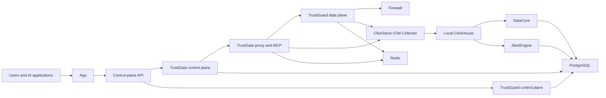

NeuralTrust supports **SaaS**, **Hybrid**, and **External** deployments. SaaS is operated by NeuralTrust. Hybrid and External use the `neuraltrust-platform` Helm chart; only those two values map to `global.deploymentMode`.

## SaaS and Hybrid architecture


This simplified topology focuses on the primary request, telemetry, and retrieval paths. The Hybrid data-plane API is omitted.

In Hybrid, TrustGate proxy/MCP, TrustGuard runtime, Firewall, the data-plane API, and optionally DataAgent run in the customer cluster. Their control planes, the app/control-plane API, DataBridge, SaaS ClickStack collector, ClickHouse, and AlertEngine remain on NeuralTrust SaaS.

Hybrid exports **metadata only** over OTLP. Raw prompts and responses stay in the customer PostgreSQL, whether deployed in-cluster or provided as a managed service. DataAgent is enrollment-gated and performs authorized outbound retrieval from PostgreSQL through DataBridge when a user requests raw data. TrustGate and TrustGuard configuration sync is optional.

## External architecture



External is the supported self-hosted model. Both control and data planes run in your environment, along with the app, control-plane API, DataCore, ClickStack OTel Collector, ClickHouse, and AlertEngine. DataAgent/DataBridge are not used. Analytics and payload storage remain local unless you explicitly enable another export or integration.

## Workload placement

| Workload | SaaS | Hybrid customer cluster | External cluster |
| --- | --- | --- | --- |
| TrustGate data plane (proxy/MCP), TrustGuard data plane | Hosted | Yes | Yes |
| TrustGate and TrustGuard control planes | Hosted | SaaS | Yes |
| Firewall | Hosted | Optional, default on | Optional, default on |
| Data-plane API | Not deployed | Yes | Yes |
| DataAgent / SaaS DataBridge | N/A | Optional / SaaS | No |
| App and control-plane API | Hosted | SaaS | Yes |
| ClickStack collector, ClickHouse, DataCore, AlertEngine | Hosted | SaaS | Yes |
| PostgreSQL and Redis | Hosted | Shared local or managed stores | Local or managed, with service-specific databases |

## Install the chart

Start from the example matching your model:

```bash
cp values-required.yaml values-hybrid.yaml

helm upgrade --install neuraltrust-platform \
  oci://europe-west1-docker.pkg.dev/neuraltrust-app-prod/helm-charts/neuraltrust-platform \
  --namespace neuraltrust --create-namespace \
  -f values-hybrid.yaml
```

Edit the copied file for the target environment. For External, create `values-external.yaml` from the concise example in [Configuration](/neuraltrust/deployment/configuration#minimal-external). See [Secrets](/neuraltrust/deployment/secrets) and your [provider guide](#provider-guides) before installing.

## Provider guides

- [GCP (GKE)](/neuraltrust/deployment/gcp/overview)
- [AWS (EKS)](/neuraltrust/deployment/aws/overview)
- [Azure (AKS)](/neuraltrust/deployment/azure/overview)
- [OpenShift](/neuraltrust/deployment/openshift/overview)
- [Vanilla Kubernetes](/neuraltrust/deployment/kubernetes/overview)
