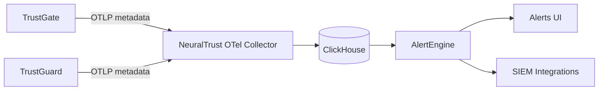

# Telemetry data reference

[Alerts](/platform/alerts) and [Use Cases](/platform/use-cases) evaluate rules over **metadata events** stored in ClickHouse. TrustGuard and TrustGate each emit one metadata record per request over **OpenTelemetry (OTLP)**; a collector lands rows in `trustgate_events` and `trustguard_events`.

<Warning>
**No raw prompt or response text** is in the metadata stream. Identifiers, verdicts, counters, and finding labels only. Raw bodies live in a separate store keyed by `trace_id` for drill-down in the UI.
</Warning>

---

## Architecture

| Stream | Storage | Used for |
|---|---|---|
| Metadata + findings | SaaS ClickHouse (`trustgate_events`, `trustguard_events`) | Rules, alerts, logs list |
| Raw payload | Client-local Postgres (hybrid) or SaaS Postgres | Prompt/response drill-down by `trace_id` |

Correlation keys across streams: `tenant_id`, `trace_id`, `session_id`.

---

## Entity and grouping

**Entity** is not a stored column. AlertEngine derives it from `consumer_id` — the v1 entity reference for "who" triggered the event.

| Logical group key | ClickHouse column | Notes |
|---|---|---|
| `entity` / `consumer` | `consumer_id` | Default alert subject |
| `session` | `session_id` | Session-scoped bursts |
| `app` | `gateway_id` (TrustGate) or `collector_id` (TrustGuard) | Per-gateway or per-collector |
| `route` | `url_path` | TrustGate HTTP path |

There is **no `ip` column**. Rules that previously grouped by IP now use **session** or **consumer**. Predefined `nt-uc-111` (Unidentified Consumer Surge) groups by **session**, not IP.

---

## Common fields (both products)

| Logical field | ClickHouse | Notes |
|---|---|---|
| `trace_id` | `trace_id` | Correlation to raw payload |
| `session` | `session_id` | Session grouping |
| `consumer` / `entity` | `consumer_id` | Entity reference |
| `consumer.name` | `consumer_name` | Display name |
| `status.code` | `http_status` | HTTP status |
| `status.outcome` | `status_outcome` | `block` \| `transform` \| `report` \| `allow` |
| `is_flagged` | `is_flagged` | 1 when any finding fires or outcome ≠ allow |
| `security` | `security` (JSON array) | Security tag labels |
| `http_method` | `http_method` | HTTP verb |
| `model` | `request_model` | LLM model |
| `total_ms` | `latency` JSON `.total_ms` | End-to-end latency |

---

## TrustGate-only fields

| Logical field | ClickHouse / JSON | Notes |
|---|---|---|
| `gateway_id` | `gateway_id` | Source gateway |
| `kind` | `kind` | `llm` \| `mcp` \| `a2a` |
| `provider` | `provider` | Upstream provider |
| `route` | `url_path` | HTTP path alias |
| `usage.*` | `usage` JSON | Token counts |
| `cost.*` | `cost` JSON | Cost in USD |
| `latency.*` | `latency` JSON | Breakdown (provider, gateway, policies, routing, …) |
| `mcp.*` | `mcp` JSON | MCP call metadata |

---

## TrustGuard-only fields

| Logical field | ClickHouse | Notes |
|---|---|---|
| `collector_id` | `collector_id` | Source collector |
| `collector_name` | `collector_name` | Display name |
| `direction` | `request_direction` | `input` \| `output` — required for output-leak rules |
| `protocol` | `request_protocol` | `llm` \| `mcp` \| `a2a` |
| `policy_id` / `policy_name` | `policy_id` / `policy_name` | Evaluating policy |
| `latency.detectors_ms` / `latency.overhead_ms` | `latency` JSON | Detector timing |

---

## Detection matching (TrustGuard)

Rules with a `detection:` block match over the raw **`detector_chain`** JSON array. AlertEngine normalizes each element **in SQL at query time** (not as a stored column).

### Rule detection fields

| Field | Meaning |
|---|---|
| `detection.type` | Canonical category: `prompt_injection`, `secrets`, `pii`, `toxicity`, `behavioral_threat`, `multi_turn_escalation`, `code_injection`, … |
| `detection.action` | `block`, `transform`, `allow`, `report` |
| `detection.confidence` | 0–1 score (coalesced from nested `signal.confidence`) |
| `detection.enforced` | Derived: true when action is `block` or `transform` |

### Plugin → type mapping (nested chain)

When the flat `detection_type` field is empty, type is derived from `source.plugin`:

| Plugin | Canonical `detection.type` |
|---|---|
| `prompt_guard`, `tool_guard` | `prompt_injection` |
| `data_loss_prevention` + `signal.type=secret` | `secrets` |
| `data_loss_prevention` (else) | `pii` |
| `toxicity` | `toxicity` |
| `anomaly_detector` | `behavioral_threat` |
| `multiturn_guard` | `multi_turn_escalation` |
| `code_sanitation` | `code_injection` |

### Finding guard

Elements that only record detector **execution** (no `detection_type`, `action`, or `signal.type`) do **not** count as findings — so clean requests where detectors ran but did not fire are excluded from detection matches.

---

## Fields in ClickHouse but not in the custom builder

The engine supports additional predicates for advanced YAML rules. These are not yet in the UI field picker:

- Latency sub-fields: `latency.policies_ms`, `latency.routing_ms`, …
- Cost sub-fields: `cost.prompt_usd`, `cost.completion_usd`, `cost.currency`
- MCP: `mcp.operation`, `mcp.transport`, `mcp.upstream_status`, `mcp.rpc_error_code`
- Policy chain fields (TrustGate)

---

## Upstream requirements

For rules to match reliably, products must emit:

| Requirement | Product | Why |
|---|---|---|
| `consumer.id` populated | Both | Entity correlation and cross-product rules |
| `detector_chain` with plugin, signal, outcome | TrustGuard | Detection normalization |
| `request.direction` | TrustGuard | Output-leak rules (nt-uc-103/104/113) |
| `url.path` | TrustGate | Route-scoped operational rules (nt-uc-205/206) |
| `is_flagged` | TrustGuard | Flagged-event rules |

---

## Related documentation

<CardGroup cols={2}>
  <Card title="Use Cases" icon="list-checks" href="/platform/use-cases">
    Custom rule builder and full UI field catalog.
  </Card>
  <Card title="TrustGate telemetry" icon="chart-line" href="/trustgate/observability/telemetry">
    How TrustGate emits per-request events.
  </Card>
  <Card title="TrustGuard overview" icon="zap" href="/trustguard/overview">
    Guardrail detections that populate TrustGuard events.
  </Card>
</CardGroup>
