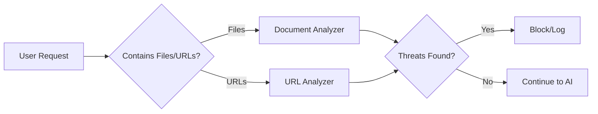

Content Analyzers are specialized plugins that inspect content from external sources before it reaches your AI application. They protect against indirect prompt injection attacks and prevent sensitive data exposure.

## Available Analyzers

<CardGroup cols={2}>
  <Card title="Document Analyzer" icon="file-pdf" href="/trustgate/content-security/content-analyzers/doc-analyzer">
    Scan uploaded files (PDF, DOCX, images) for PII and sensitive content
  </Card>
  <Card title="URL Analyzer" icon="link" href="/trustgate/content-security/content-analyzers/url-analyzer">
    Fetch and analyze content from URLs for jailbreaks and PII
  </Card>
</CardGroup>

## Why Content Analyzers?

Modern AI applications often process content from multiple sources:

- **Uploaded documents**: Users attach files to their requests
- **External URLs**: Users reference links that the AI should analyze
- **Embedded content**: Documents may contain links to other resources

Each of these represents a potential attack vector:

| Threat | Description |
|--------|-------------|
| **Indirect Prompt Injection** | Malicious instructions hidden in documents or web pages |
| **Data Exfiltration** | Sensitive data embedded in external content |
| **PII Exposure** | Personal information in uploaded files |

## How They Work

## Common Configuration

Both analyzers share similar configuration patterns:

| Setting | Description |
|---------|-------------|
| `mode` | `protect` to block threats, `observe` to log only |
| `pii.entities` | List of PII types to detect |

## Use Cases

1. **RAG Applications**: Ensure retrieved documents don't contain malicious prompts
2. **Document Processing**: Validate user uploads before AI processing
3. **Web Scraping**: Analyze fetched web content for security threats
4. **Compliance**: Detect and log sensitive data in all content sources
